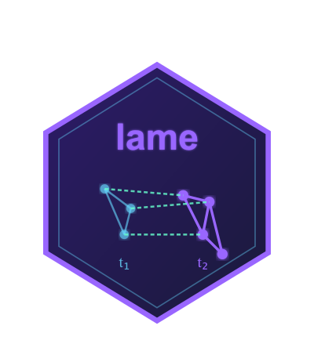

# **lame** 

<!-- badges: start -->
[](https://github.com/netify-dev/lame/actions/workflows/R-CMD-check.yaml)
<!-- badges: end -->

> **L**ongitudinal **A**dditive and **M**ultiplicative **E**ffects Models for Networks

The `lame` package builds on and extends Peter Hoff's [`amen`](https://CRAN.R-project.org/package=amen) package, which implements Additive and Multiplicative Effects (AME) models for cross-sectional network analysis. While `amen` provides the foundational Bayesian framework for modeling network data with latent factor and nodal random effects, `lame` extends this in several directions: (1) longitudinal network analysis via `lame()` with dynamic additive and multiplicative effects modeled as AR(1) processes, (2) support for bipartite (rectangular) network structures, (3) C++ acceleration of core MCMC sampling routines via Rcpp and RcppArmadillo, and (4) a full suite of S3 methods (`coef()`, `vcov()`, `confint()`, `predict()`, `fitted()`, `residuals()`, `simulate()`) for standard R model interoperability.

The package includes two main functions: `ame()` for cross-sectional network analysis and `lame()` for longitudinal network analysis with dynamic effects that capture temporal heterogeneity through autoregressive processes. Both functions support unipartite (square) and bipartite (rectangular) network structures.

## Installation

Install from GitHub (requires C++ build tools: Xcode CLI on macOS, Rtools on Windows, or `build-essential` on Linux):

```r
# install.packages("devtools")
devtools::install_github("netify-dev/lame", dependencies = TRUE)
```

## Quick Start

```r
library(lame)

# Load example data (creates Y, Xdyad, Xrow, Xcol in your workspace)
data("vignette_data")

# Y      — list of 4 binary network matrices (35 × 35, years 1993–2000)
# Xdyad  — list of dyadic covariate arrays (distance, shared IGOs)
# Xrow   — list of sender covariate matrices (GDP, population)
# Xcol   — list of receiver covariate matrices (GDP, population)

# Fit a basic longitudinal AME model
fit <- lame(
  Y = Y,                    # List of T network matrices
  Xdyad = Xdyad,           # Dyadic covariates
  Xrow = Xrow,             # Sender covariates
  Xcol = Xcol,             # Receiver covariates
  family = "binary",       # Network type
  R = 2,                   # Latent dimensions
  burn = 100,              # Burn-in iterations
  nscan = 500              # Post-burn samples
)

# Summary and diagnostics
summary(fit)
```

### Dynamic Effects

The key innovation in `lame` is time-varying network effects:

```r
# Fit model with dynamic effects (builds on fit and data from Quick Start above)
fit_dynamic <- lame(
  Y = Y,
  Xdyad = Xdyad,
  Xrow = Xrow,
  Xcol = Xcol,
  family = "binary",
  dynamic_ab = TRUE,       # Time-varying sender/receiver effects
  dynamic_uv = TRUE,       # Time-varying latent positions
  R = 2,
  burn = 100,
  nscan = 500,
  prior = list(
    rho_uv_mean = 0.9,    # High persistence for latent factors
    rho_ab_mean = 0.8     # Moderate persistence for additive effects
  )
)
```

## Visualization

```r
# Additive effects (sender/receiver)
ab_plot(fit, effect = "sender")                    # Static effects
ab_plot(fit_dynamic, plot_type = "trajectory")     # Dynamic over time

# Multiplicative effects (latent factors)
uv_plot(fit)                                       # Static latent positions
uv_plot(fit_dynamic, plot_type = "trajectory")     # Dynamic trajectories

# Diagnostics
trace_plot(fit)                                     # MCMC convergence
gof_plot(fit)                                       # Goodness-of-fit
```

## Key Features

### Network Analysis

- **Cross-sectional**: `ame()` fits AME models for a single network snapshot
- **Longitudinal**: `lame()` fits AME models for networks observed over multiple time periods
- **Bipartite**: full support for two-mode (rectangular) networks in both `ame()` and `lame()`
- **8 families**: normal, binary, ordinal, poisson, tobit, censored binary, fixed rank nomination, row-ranked likelihood

### Dynamic Modeling

- **Time-varying latent positions** (`dynamic_uv`): captures evolving community structure via AR(1) processes
- **Time-varying heterogeneity** (`dynamic_ab`): models changing sender/receiver activity over time
- **Flexible priors**: customizable temporal persistence and innovation variance

### Inference and Diagnostics

- **S3 methods**: `coef()`, `vcov()`, `confint()`, `residuals()`, `predict()`, `summary()`
- **Visualization**: `trace_plot()`, `gof_plot()`, `uv_plot()`, `ab_plot()`
- **Simulation**: `simulate()` and `gof()` for posterior predictive checks

## Documentation

| Vignette | Topic |
| --- | --- |
| `vignette("lame-overview")` | Getting started |
| `vignette("cross_sec_ame")` | Cross-sectional AME models |
| `vignette("lame")` | Longitudinal models |
| `vignette("bipartite")` | Bipartite networks |
| `vignette("dynamic_effects")` | Dynamic effects |

## Citation

If you use `lame` in your research, please cite:

```bibtex
@Manual{lame2026,
  title = {lame: Longitudinal Additive and Multiplicative Effects Models for Networks},
  author = {Cassy Dorff and Shahryar Minhas and Tosin Salau},
  year = {2026},
  note = {R package version 1.0.0},
  url = {https://github.com/netify-dev/lame},
}
```

The dynamic effects implementation draws on:

- Sewell, D. K., & Chen, Y. (2015). Latent space models for dynamic networks. *Journal of the American Statistical Association*, 110(512), 1646-1657. [doi:10.1080/01621459.2014.988214](https://doi.org/10.1080/01621459.2014.988214)
- Durante, D., & Dunson, D. B. (2014). Nonparametric Bayes dynamic modeling of relational data. *Biometrika*, 101(4), 883-898. [doi:10.1093/biomet/asu040](https://doi.org/10.1093/biomet/asu040)

## Contributors

- **Cassy Dorff** (Vanderbilt University)
- **Shahryar Minhas** (Michigan State University)
- **Tosin Salau** (Michigan State University)

## License

MIT License - see [LICENSE](LICENSE) file for details.

## Support

- **Bug Reports**: [GitHub Issues](https://github.com/netify-dev/lame/issues)
- **Questions**: [GitHub Discussions](https://github.com/netify-dev/lame/discussions)
- **Contact**: [minhassh@msu.edu](mailto:minhassh@msu.edu)
