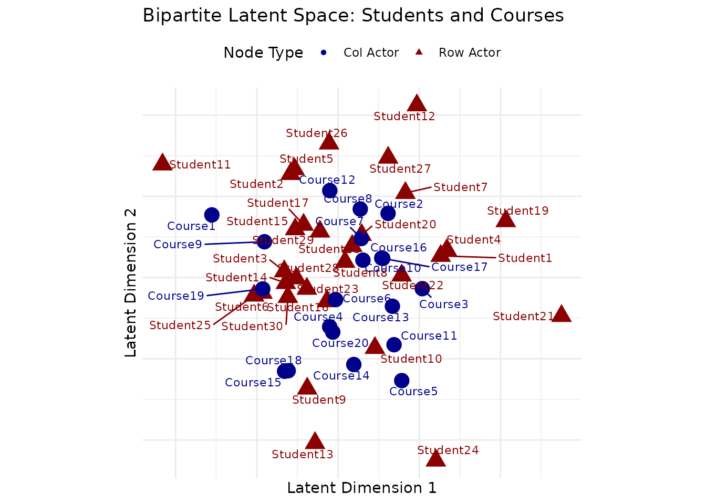
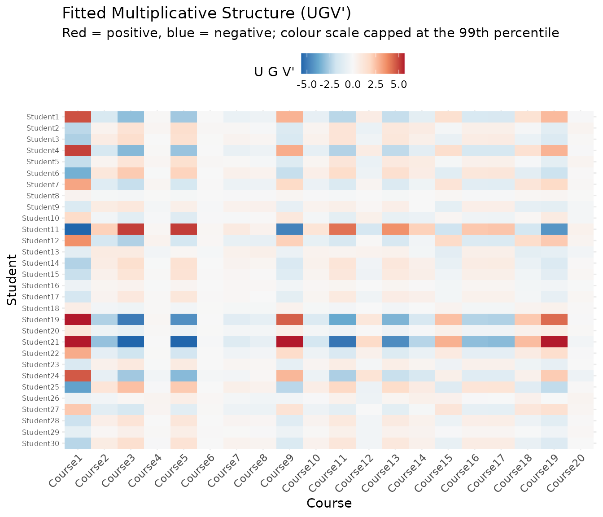
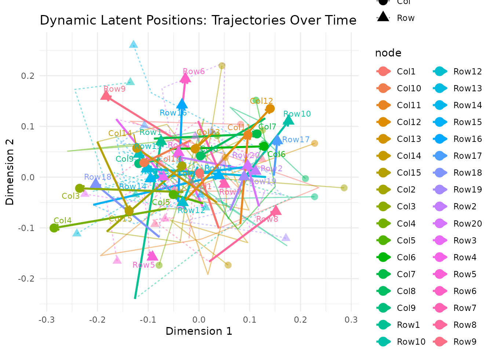
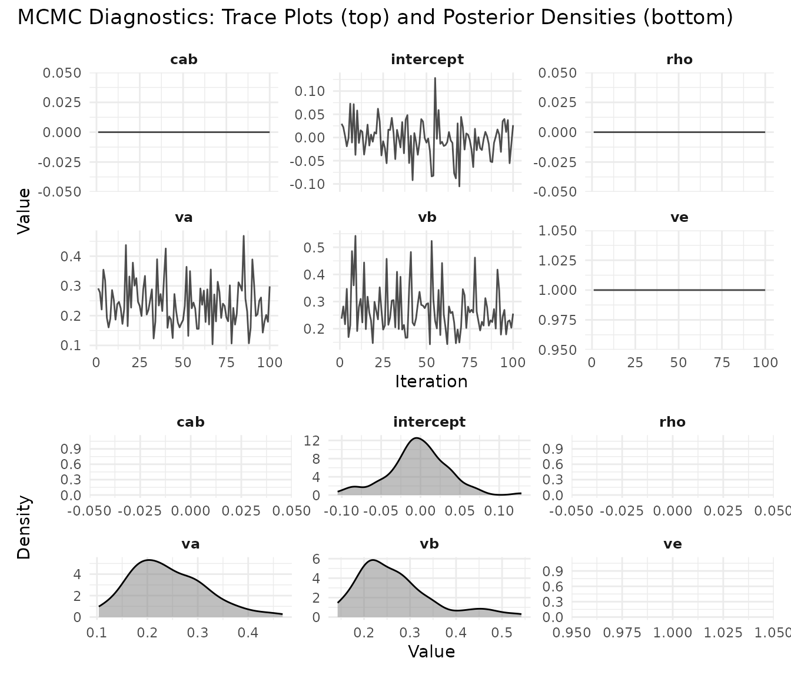
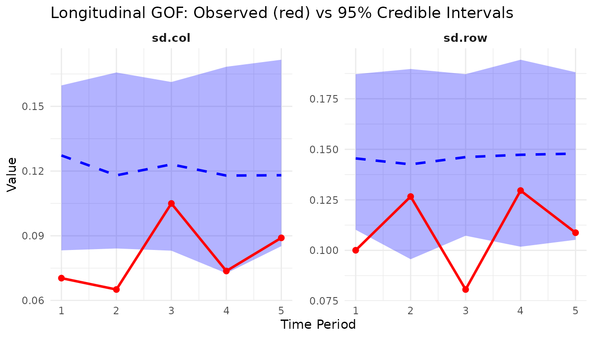
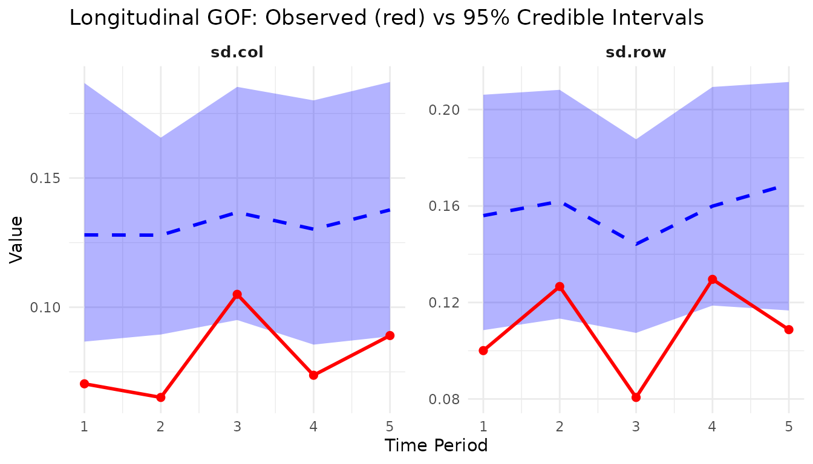
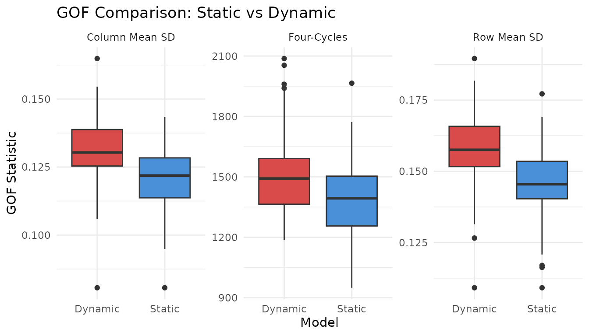
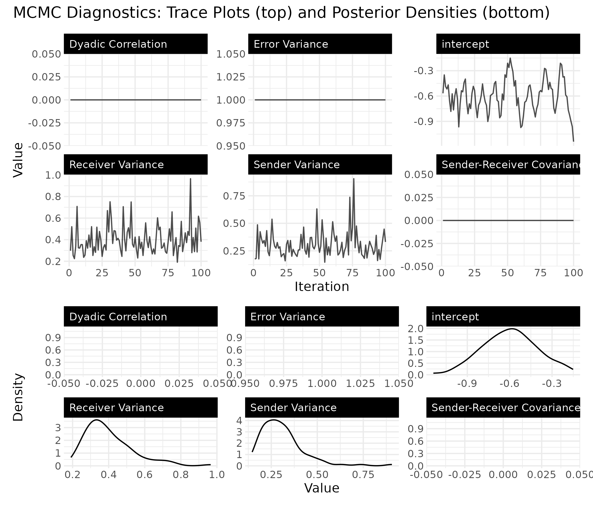

# Bipartite Network Analysis

``` r
library(lame)
library(ggplot2)
library(reshape2)
set.seed(6886)
```

## Introduction

Not all networks are created equal. Many real-world networks are
**bipartite**, meaning they have two distinct types of nodes, and ties
only form between types, never within them. Students enroll in courses.
Countries sign treaties. Legislators join committees. Users purchase
products. In each case, the adjacency matrix is rectangular rather than
square, and the row and column nodes play fundamentally different roles.

The `lame` package supports bipartite networks through both
[`ame()`](https://netify-dev.github.io/lame/reference/ame.md)
(cross-sectional) and
[`lame()`](https://netify-dev.github.io/lame/reference/lame.md)
(longitudinal). The key difference from the unipartite case is that the
model uses separate latent spaces for the two node types, connected by
an interaction matrix $G$ that captures how row-node and column-node
characteristics relate to each other.

## The Bipartite AME Model

In a bipartite network, the probability of a tie between row node $i$
and column node $j$ is modeled as:

$$y_{ij} = \beta\prime x_{ij} + a_{i} + b_{j} + u_{i}\prime Gv_{j} + \epsilon_{ij}$$

The additive effects work just as in the unipartite case: $a_{i}$
captures how “active” row node $i$ is (e.g., a student who takes many
courses), and $b_{j}$ captures how “popular” column node $j$ is (e.g., a
course with high enrollment). But the multiplicative term
$u_{i}\prime Gv_{j}$ is different. Instead of $u_{i}\prime v_{j}$ with
shared latent dimensions, the row and column nodes live in potentially
different-dimensional latent spaces ($R_{\text{row}}$ and
$R_{\text{col}}$), and the interaction matrix $G$ maps between them.
This is more flexible, letting the model discover that, say, two
dimensions of student preferences map onto three dimensions of course
characteristics.

A few things drop away in the bipartite setting. There is no dyadic
correlation parameter $\rho$, because ties are inherently directional
from row to column nodes (you can’t have a reciprocal tie in a
student–course network). The additive effects $a$ and $b$ also have
independent variances rather than a joint covariance, since they
describe fundamentally different types of actors.

## Cross-Sectional Analysis with `ame()`

### Simulating Data

To illustrate the workflow, we simulate a bipartite network of 30
students and 20 courses. Each student has a 2-dimensional latent
position that captures their academic preferences, and each course has a
2-dimensional latent position that captures what kind of student it
attracts. The interaction matrix $G$ determines how these latent
dimensions combine to predict enrollment.

``` r
# Simulate a student-course enrollment network
n_students <- 30
n_courses <- 20

# True latent positions (unobserved in practice)
U_true <- matrix(rnorm(n_students * 2), n_students, 2)
V_true <- matrix(rnorm(n_courses * 2), n_courses, 2)

# Interaction matrix: dimension 1 has positive affinity,
# dimension 2 has negative (students high on dim 2 avoid courses high on dim 2)
G_true <- matrix(c(1, 0.5, 0.5, -1), 2, 2)

# Generate enrollment probabilities and binary outcomes
eta <- U_true %*% G_true %*% t(V_true)
prob <- plogis(eta)
Y_bipartite <- matrix(rbinom(n_students * n_courses, 1, prob),
                      n_students, n_courses)

rownames(Y_bipartite) <- paste0("Student", 1:n_students)
colnames(Y_bipartite) <- paste0("Course", 1:n_courses)

cat("Network dimensions:", dim(Y_bipartite), "\n")
#> Network dimensions: 30 20
cat("Enrollment rate:", round(mean(Y_bipartite), 2), "\n")
#> Enrollment rate: 0.54
```

### Fitting the Model

Fitting a bipartite model requires setting `mode = "bipartite"` and
specifying the latent dimensions for each node type separately via
`R_row` and `R_col`.

``` r
# Note: burn/nscan are kept small here for fast vignette building.
# For real analyses, use burn >= 1000 and nscan >= 5000.
fit_cross <- ame(
  Y = Y_bipartite,
  mode = "bipartite",
  R_row = 2,              # latent dimensions for students
  R_col = 2,              # latent dimensions for courses
  family = "binary",
  burn = 100,
  nscan = 500,
  odens = 5,
  verbose = FALSE
)

summary(fit_cross)
#> 
#> === AME Model Summary ===
#> 
#> Call:
#> [1] "Y ~ a[i] + b[j], family = 'binary'"
#> 
#> Regression coefficients:
#> ------------------------
#>       Estimate StdError z_value p_value CI_lower CI_upper  
#> beta0    0.136    0.167   0.815   0.415   -0.192    0.464  
#> ---
#> Signif. codes: 0 '***' 0.001 '**' 0.01 '*' 0.05 '.' 0.1 ' ' 1
#> 
#> Variance components:
#> -------------------
#>     Estimate StdError
#> va     0.248    0.093
#> cab    0.000    0.000
#> vb     0.334    0.112
#> ve     1.000    0.000
#> rho    0.000    0.000
#>   (va = sender, cab = sender-receiver covariance, vb = receiver,
#>    rho = dyadic correlation, ve = residual variance)
#>   Note: bipartite model (rho fixed to 0, cab fixed to 0)
```

The output includes posterior means for the student latent positions
(`U`), course latent positions (`V`), and the interaction matrix (`G`),
along with additive effects: `APM` for student activity levels and `BPM`
for course popularity.

### Visualizing the Latent Space

The `uv_plot` function with `layout = "biplot"` places both row and
column nodes in the same latent space, making it easy to see which
students cluster near which courses. Students and courses that appear
close together in this plot have a higher predicted probability of a
tie.

``` r
uv_plot(fit_cross, layout = "biplot") +
  ggtitle("Bipartite Latent Space: Students and Courses")
```



The interaction matrix $G$ tells us how the latent dimensions relate to
each other. Positive entries mean that students and courses that score
similarly on a dimension are more likely to be connected; negative
entries mean the opposite.

``` r
G_melt <- melt(fit_cross$G)
ggplot(G_melt, aes(x = Var2, y = Var1, fill = value)) +
  geom_tile() +
  scale_fill_gradient2(low = "blue", mid = "white", high = "red") +
  labs(title = "Estimated Interaction Matrix G",
       x = "Column Dimension", y = "Row Dimension") +
  theme_minimal()
```



## Longitudinal Analysis with `lame()`

When bipartite networks are observed over multiple time periods (say,
student enrollments across semesters, or country–treaty memberships
across decades),
[`lame()`](https://netify-dev.github.io/lame/reference/lame.md) lets you
pool information across time while optionally allowing the latent
structure to evolve.

### Simulating Longitudinal Data

We simulate a panel of user–item interaction networks over 5 periods.
The underlying latent structure is held fixed (for now), with small
random shocks to the overall baseline at each period.

``` r
n_periods <- 5
n_users <- 20
n_items <- 15

U_long <- matrix(rnorm(n_users * 2), n_users, 2)
V_long <- matrix(rnorm(n_items * 2), n_items, 2)
G_long <- matrix(c(1, 0.3, 0.3, -0.8), 2, 2)

Y_list <- list()
for(t in 1:n_periods) {
  eta_t <- U_long %*% G_long %*% t(V_long) + rnorm(1, 0, 0.2)
  prob_t <- plogis(eta_t)
  Y_list[[t]] <- matrix(rbinom(n_users * n_items, 1, prob_t),
                        n_users, n_items)
  rownames(Y_list[[t]]) <- paste0("User", 1:n_users)
  colnames(Y_list[[t]]) <- paste0("Item", 1:n_items)
}
names(Y_list) <- paste0("T", 1:n_periods)

cat("Time periods:", length(Y_list), "\n")
#> Time periods: 5
cat("Dimensions per period:", dim(Y_list[[1]]), "\n")
#> Dimensions per period: 20 15
cat("Average density:", round(mean(sapply(Y_list, mean)), 2), "\n")
#> Average density: 0.51
```

### Static Model

The simplest longitudinal model assumes that the latent positions and
additive effects are constant over time. This pools all time periods
together to get a single estimate of each actor’s latent position,
useful when you believe the underlying structure is stable and you just
want more data to estimate it precisely.

``` r
# Note: iterations are kept small for vignette speed; use burn >= 1000
# and nscan >= 5000 for real analyses.
fit_static <- lame(
  Y = Y_list,
  mode = "bipartite",
  R_row = 2,
  R_col = 2,
  family = "binary",
  dynamic_uv = FALSE,
  dynamic_ab = FALSE,
  burn = 100,
  nscan = 500,
  odens = 5,
  verbose = FALSE,
  plot = FALSE
)

summary(fit_static)
#> 
#> === Longitudinal AME Model Summary ===
#> 
#> Call:
#> NULL
#> 
#> Time periods: 5 
#> Family: binary 
#> Mode: bipartite 
#> 
#> Regression coefficients:
#> ------------------------
#>           Estimate StdError z_value p_value CI_lower CI_upper  
#> intercept    0.023    0.159   0.147   0.883   -0.289    0.336  
#> ---
#> Signif. codes: 0 '***' 0.001 '**' 0.01 '*' 0.05 '.' 0.1 ' ' 1
#> 
#> Variance components:
#> -------------------
#>     Estimate StdError
#> va     0.235    0.075
#> cab    0.000    0.000
#> vb     0.268    0.101
#> rho    0.000    0.000
#> ve     1.000    0.000
#>   (va = sender, cab = sender-receiver covariance, vb = receiver,
#>    rho = dyadic correlation, ve = residual variance)
```

### Dynamic Model

When you suspect the latent structure changes over time (users’ tastes
shift, items gain or lose popularity), the dynamic model lets the latent
positions and additive effects drift via AR(1) processes. A high
autoregressive parameter ($\rho$ close to 1) means slow, gradual change;
a low one means the structure is more volatile from period to period.

``` r
# Same reduced iterations as above for vignette speed.
fit_dynamic <- lame(
  Y = Y_list,
  mode = "bipartite",
  R_row = 2,
  R_col = 2,
  family = "binary",
  dynamic_uv = TRUE,
  dynamic_ab = TRUE,
  burn = 100,
  nscan = 500,
  odens = 5,
  verbose = FALSE,
  plot = FALSE
)

summary(fit_dynamic)
#> 
#> === Longitudinal AME Model Summary ===
#> 
#> Call:
#> NULL
#> 
#> Time periods: 5 
#> Family: binary 
#> Mode: bipartite 
#> Dynamic latent positions: enabled (rho_uv = 0.391 )
#> Dynamic additive effects: enabled (rho_ab = 0.485 )
#> 
#> Regression coefficients:
#> ------------------------
#>           Estimate StdError z_value p_value CI_lower CI_upper  
#> intercept   -0.003    0.038  -0.084   0.933   -0.078    0.072  
#> ---
#> Signif. codes: 0 '***' 0.001 '**' 0.01 '*' 0.05 '.' 0.1 ' ' 1
#> 
#> Variance components:
#> -------------------
#>     Estimate StdError
#> va     0.241    0.075
#> cab    0.000    0.000
#> vb     0.268    0.086
#> rho    0.000    0.000
#> ve     1.000    0.000
#>   (va = sender, cab = sender-receiver covariance, vb = receiver,
#>    rho = dyadic correlation, ve = residual variance)
```

### Visualizing Temporal Evolution

With dynamic effects, `uv_plot` can show trajectories, illustrating how
each actor’s latent position moves through the space over time. Each
line traces one actor’s path from the first to the last period,
revealing which actors’ roles are stable and which are shifting.

``` r
uv_plot(fit_dynamic, plot_type = "trajectory") +
  ggtitle("Dynamic Latent Positions: Trajectories Over Time")
```



Convergence diagnostics are especially important for dynamic models,
since the additional parameters ($\rho$, innovation variances) need
adequate samples to be well-estimated.

``` r
trace_plot(fit_dynamic)
```



## Comparing Static and Dynamic Models

A natural question is whether the dynamic model is worth the added
complexity. The goodness-of-fit plots provide one way to compare: if the
dynamic model’s posterior predictive distributions better cover the
observed statistics, the extra flexibility is paying off.

``` r
# GOF plots for each model
gof_plot(fit_static)
```



``` r
gof_plot(fit_dynamic)
```



We can also compare the GOF statistics directly. For bipartite networks,
the key statistics are the standard deviation of row means (how much
users vary in activity), the standard deviation of column means (how
much items vary in popularity), and the four-cycle count (a measure of
clustering in bipartite networks, analogous to transitivity in
unipartite networks).

``` r
gof_static <- fit_static$GOF
gof_dynamic <- fit_dynamic$GOF

gof_df <- data.frame(
  value = c(
    colMeans(gof_static$sd.rowmean), colMeans(gof_dynamic$sd.rowmean),
    colMeans(gof_static$sd.colmean), colMeans(gof_dynamic$sd.colmean),
    colMeans(gof_static$four.cycles), colMeans(gof_dynamic$four.cycles)
  ),
  model = rep(c("Static", "Dynamic"), 3,
              each = ncol(gof_static$sd.rowmean)),
  statistic = rep(c("Row Mean SD", "Column Mean SD", "Four-Cycles"),
                  each = 2 * ncol(gof_static$sd.rowmean))
)

ggplot(gof_df, aes(x = model, y = value, fill = model)) +
  geom_boxplot() +
  scale_fill_manual(values = c(Dynamic = "#D94A4A", Static = "#4A90D9")) +
  facet_wrap(~statistic, scales = "free_y") +
  labs(title = "GOF Comparison: Static vs Dynamic",
       x = "Model", y = "GOF Statistic") +
  theme_minimal() +
  theme(legend.position = "none")
```



### Choosing Latent Dimensions

The number of latent dimensions (`R_row`, `R_col`) controls how rich the
multiplicative structure is. Too few dimensions and the model can’t
capture the latent clustering; too many and you risk overfitting (and
slower computation). A practical approach is to fit models with
different dimensions and compare their GOF statistics.

``` r
dims_to_test <- list(
  c(1, 1),
  c(2, 2)
)

gof_results <- list()
for(i in seq_along(dims_to_test)) {
  fit_temp <- ame(
    Y = Y_bipartite,
    mode = "bipartite",
    R_row = dims_to_test[[i]][1],
    R_col = dims_to_test[[i]][2],
    family = "binary",
    burn = 100,
    nscan = 500,
    odens = 5,
    verbose = FALSE
  )
  gof_results[[i]] <- c(
    R_row = dims_to_test[[i]][1],
    R_col = dims_to_test[[i]][2],
    gof_rowmean = mean(abs(fit_temp$GOF[, "sd.rowmean"])),
    gof_fourcycles = mean(abs(fit_temp$GOF[, "four.cycles"]))
  )
}

do.call(rbind, gof_results)
#>      R_row R_col gof_rowmean gof_fourcycles
#> [1,]     1     1   0.1422260       7239.300
#> [2,]     2     2   0.1409541       7266.175
```

Smaller GOF values (closer to zero) indicate better fit. Look for the
point where adding more dimensions stops improving the GOF appreciably.

## Practical Guidance

**When to use bipartite models.** Use bipartite mode whenever your
network has two fundamentally different types of nodes and ties only
form between types. If your adjacency matrix is rectangular, you almost
certainly need it. Even if it happens to be square (e.g., 20 students
and 20 courses), set `mode = "bipartite"` if the row and column nodes
represent different kinds of entities.

**Interpreting the output.** The additive effects (`APM`, `BPM`) have
the most direct interpretation: they tell you which row nodes are
unusually active and which column nodes are unusually popular, after
controlling for covariates and latent structure. The latent positions
(`U`, `V`) and interaction matrix (`G`) together capture residual
patterns of association, answering the question “beyond the covariates
and overall activity levels, which row nodes tend to connect to which
column nodes?”

## Convergence Diagnostics

As with any Bayesian model, always check convergence before interpreting
results. The `trace_plot` function shows MCMC traces and posterior
densities for the regression coefficients and variance components.

``` r
trace_plot(fit_cross)
```



Look for traces that mix well (no long flat stretches or slow drifts)
and densities that are smooth and unimodal. With the short chains used
in this vignette, convergence is not guaranteed. In practice, run longer
chains and consider multiple starting values.

## Extracting Positions for Custom Analysis

If you need the latent positions in a tidy format (e.g., for merging
with external data or building custom plots), the
[`latent_positions()`](https://netify-dev.github.io/lame/reference/latent_positions.md)
function returns a data frame with one row per actor-dimension-time
combination:

``` r
lp <- latent_positions(fit_cross)
head(lp)
#>   actor dimension time      value posterior_sd type
#> 1 node1         1 <NA> -1.9086611           NA    U
#> 2 node2         1 <NA>  0.8718661           NA    U
#> 3 node3         1 <NA>  2.0128221           NA    U
#> 4 node4         1 <NA> -0.7177380           NA    U
#> 5 node5         1 <NA>  0.3638942           NA    U
#> 6 node6         1 <NA>  3.0011548           NA    U

# Filter to just the row nodes (students)
lp_students <- lp[lp$type == "U", ]
cat("Student positions:", nrow(lp_students), "rows\n")
#> Student positions: 60 rows
```

This is especially useful for bipartite networks where U (row nodes) and
V (column nodes) have different numbers of actors.
