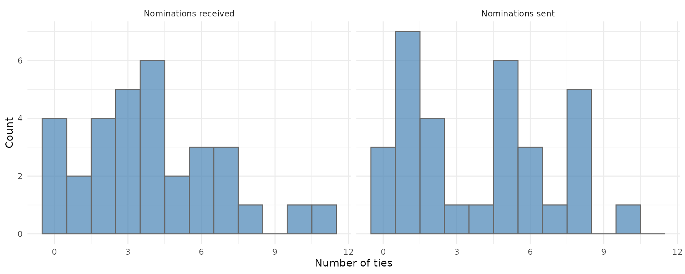
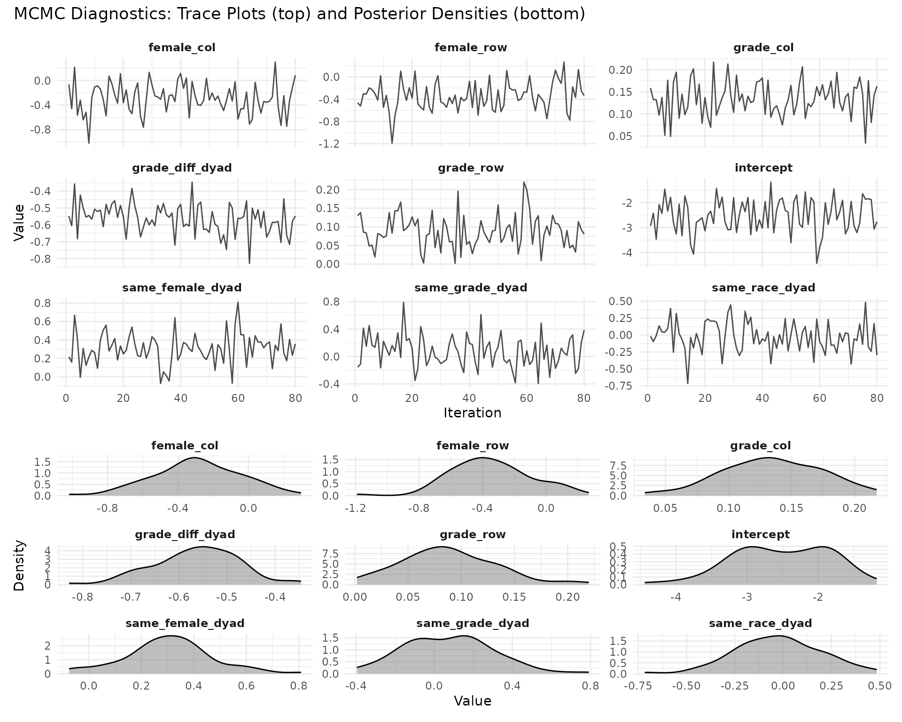
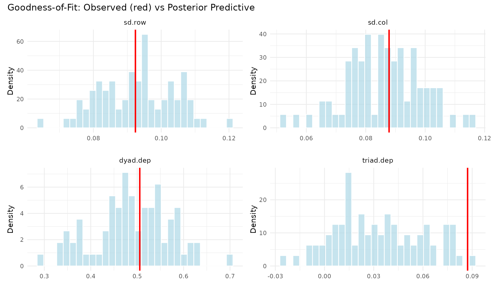
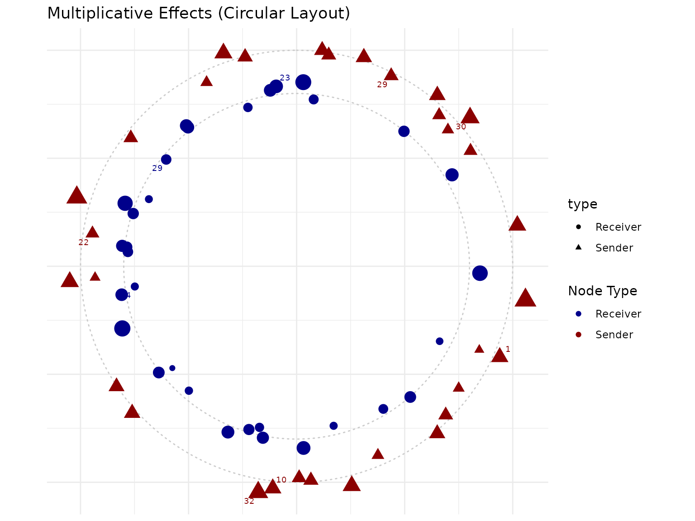
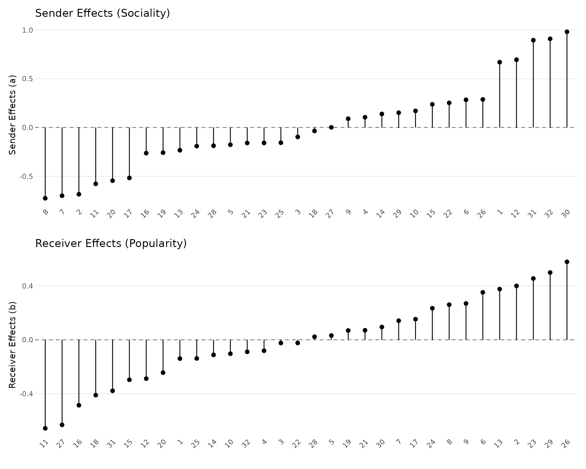
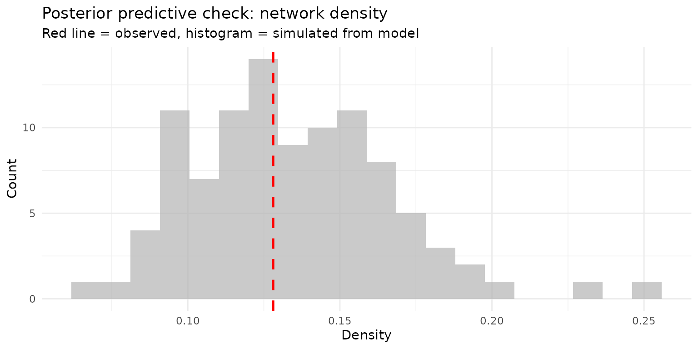

# Your First AME Model

## Why Network Models?

Imagine you’re studying friendships in a high school. You have data on
who nominated whom as a friend, plus information about each student
(gender, race, grade). A natural first instinct is to run a logistic
regression: does sharing the same gender predict friendship?

The problem is that friendships aren’t independent observations. Some
students are just more social than others (they nominate lots of friends
regardless of who). Some students are more popular (they receive lots of
nominations). And friendships tend to be reciprocated: if Alice names
Bob, Bob is more likely to name Alice. A standard regression ignores all
of this, and your standard errors will be wrong.

The **Additive and Multiplicative Effects (AME)** model handles these
dependencies directly. It gives each actor a sender effect ($a_{i}$, how
social they are), a receiver effect ($b_{j}$, how popular they are), and
a position in a latent space ($u_{i}$, $v_{j}$) that captures who tends
to connect with whom beyond what the covariates explain. Think of it as
a regression that takes network structure seriously.

## The Data

We’ll analyze a friendship network from the [Add Health
study](https://addhealth.cpc.unc.edu/), a longitudinal study of
adolescents in the United States. The `addhealthc3` dataset in `lame`
contains a directed friendship nomination network along with student
characteristics.

``` r
library(lame)
library(ggplot2)
set.seed(123)

# Load the Add Health friendship network
data(addhealthc3)

# Convert valued network to binary (any nomination = friendship)
Y <- (addhealthc3$Y > 0) * 1
X_nodes <- addhealthc3$X

n <- nrow(Y)
cat("Students:", n, "\n")
#> Students: 32
cat("Friendships:", sum(Y, na.rm = TRUE), "\n")
#> Friendships: 127
cat("Network density:", round(mean(Y, na.rm = TRUE), 3), "\n")
#> Network density: 0.128
```

Before modeling, let’s look at the basic structure. How much do students
vary in their number of friends?

``` r
out_degree <- rowSums(Y, na.rm = TRUE)
in_degree <- colSums(Y, na.rm = TRUE)

degree_df <- data.frame(
  Degree = c(out_degree, in_degree),
  Type = rep(c("Nominations sent", "Nominations received"), each = n)
)

ggplot(degree_df, aes(x = Degree)) +
  geom_histogram(binwidth = 1, alpha = 0.7, fill = "steelblue", color = "grey40") +
  facet_wrap(~Type, ncol = 2) +
  labs(x = "Number of ties", y = "Count") +
  theme_minimal()
```



There’s real variation here: some students are much more social than
others, and some are much more popular. This is exactly what the sender
and receiver random effects will capture.

## Building Covariates

The classic question in friendship networks is **homophily**: do birds
of a feather flock together? We’ll test whether students are more likely
to be friends with others of the same gender, race, and grade.

``` r
# Homophily indicators: 1 if same, 0 if different
same_female <- outer(X_nodes[,"female"], X_nodes[,"female"], "==") * 1
same_race <- outer(X_nodes[,"race"], X_nodes[,"race"], "==") * 1
same_grade <- outer(X_nodes[,"grade"], X_nodes[,"grade"], "==") * 1
grade_diff <- abs(outer(X_nodes[,"grade"], X_nodes[,"grade"], "-"))

# Pack into a 3D array (n x n x p)
Xdyad <- array(NA, dim = c(n, n, 4))
Xdyad[,,1] <- same_female
Xdyad[,,2] <- same_race
Xdyad[,,3] <- same_grade
Xdyad[,,4] <- grade_diff
dimnames(Xdyad)[[3]] <- c('same_female', 'same_race', 'same_grade', 'grade_diff')
for(k in 1:4) diag(Xdyad[,,k]) <- NA

# Nodal covariates (sender and receiver characteristics)
Xrow <- X_nodes[, c("female", "grade")]
Xcol <- X_nodes[, c("female", "grade")]
```

## Fitting the Model

Now the fun part. We fit a binary probit AME model with:

- **Covariates** for homophily effects (do similar students become
  friends?)
- **Sender and receiver random effects** (some students are more
  social/popular)
- **Dyadic correlation** (reciprocity: friendships tend to be mutual)
- **2-dimensional latent space** (residual clustering beyond what
  covariates explain)

``` r
fit <- ame(Y,
          Xdyad = Xdyad,
          Xrow = Xrow,
          Xcol = Xcol,
          R = 2,              # 2D latent space
          family = "binary",  # probit model for 0/1 data
          rvar = TRUE,        # sender random effects
          cvar = TRUE,        # receiver random effects
          dcor = TRUE,        # dyadic correlation (reciprocity)
          burn = 500,         # burn-in (increase for publication)
          nscan = 2000,       # sampling iterations
          odens = 25,         # thinning
          verbose = TRUE,
          gof = TRUE)
```

## What Did We Find?

``` r
summary(fit)
#> 
#> === AME Model Summary ===
#> 
#> Call:
#> [1] "Y ~ intercept + dyad(same_female, same_race, same_grade, grade_diff) + row(female, grade) + col(female, grade) + a[i] + b[j] + rho*e[ji] + U[i,1:2] %*% V[j,1:2], family = 'binary'"
#> 
#> Regression coefficients:
#> ------------------------
#>                  Estimate StdError z_value p_value CI_lower CI_upper    
#> intercept          -2.523    0.677  -3.725       0   -3.851   -1.196 ***
#> female_row         -0.347    0.254  -1.362   0.173   -0.845    0.152    
#> grade_row           0.088    0.045   1.972   0.049    0.001    0.176   *
#> female_col         -0.289    0.248  -1.165   0.244   -0.776    0.197    
#> grade_col           0.135    0.039   3.424   0.001    0.058    0.212 ***
#> same_female_dyad    0.305    0.167   1.826   0.068   -0.022    0.633   .
#> same_race_dyad     -0.026    0.222  -0.115   0.908   -0.461     0.41    
#> same_grade_dyad     0.074    0.231   0.322   0.747   -0.378    0.527    
#> grade_diff_dyad    -0.563    0.089  -6.313       0   -0.738   -0.388 ***
#> ---
#> Signif. codes: 0 '***' 0.001 '**' 0.01 '*' 0.05 '.' 0.1 ' ' 1
#> 
#> Variance components:
#> -------------------
#>     Estimate StdError
#> va     0.323    0.106
#> cab    0.012    0.070
#> vb     0.206    0.076
#> rho    0.877    0.065
#> ve     1.000    0.000
#>   (va = sender, cab = sender-receiver covariance, vb = receiver,
#>    rho = dyadic correlation, ve = residual variance)
```

Let’s unpack the key results:

**Homophily effects.** Look at the regression coefficients. Positive
values mean the covariate increases the probability of a tie. Same-race
and same-grade effects tell us whether students preferentially befriend
others like themselves. The grade difference effect tells us whether
friendships cross grade boundaries.

**Variance components.** The sender variance (`va`) and receiver
variance (`vb`) quantify how much students differ in their sociality and
popularity. Larger values mean more heterogeneity. The dyadic
correlation (`rho`) captures reciprocity: positive values mean if A
nominates B, B is more likely to nominate A back.

For binary networks with a probit link, a rough rule of thumb is that a
coefficient of $\beta$ changes the probability of a tie by about
$0.4 \times \beta$ at the mean.

## Did the Sampler Converge?

Since `lame` uses MCMC (Markov chain Monte Carlo), we need to verify
that the sampler explored the posterior distribution thoroughly. The
`trace_plot` function is the first tool to reach for.

``` r
trace_plot(fit, params = "beta", ncol = 3)
```



**What to look for:** The trace plots (left) should look like “fuzzy
caterpillars” bouncing around a stable mean. If you see long trends, the
chain hasn’t converged. The density plots (right) should be smooth and
unimodal. With 80 post-burn-in samples, convergence should be
reasonable, but for a publication you’d want longer chains.

## Does the Model Fit the Data?

Goodness-of-fit (GOF) checks whether the model can reproduce key
structural features of the observed network. This goes beyond dyad-level
prediction: it tests whether the model captures emergent properties like
degree heterogeneity, reciprocity patterns, and clustering.

``` r
gof_plot(fit)
```



Each panel shows a different network statistic. The histogram is the
distribution from simulated networks drawn from the fitted model; the
vertical line is the observed value. When the observed value falls well
within the simulated distribution, the model is capturing that aspect of
the data. When it falls in the tails, the model is missing something.

You can also compute GOF after the fact using the
[`gof()`](https://netify-dev.github.io/lame/reference/gof.md) function,
which is useful if you want to test custom statistics:

``` r
# Define a custom statistic: degree correlation
custom_stats <- function(Y) {
  out_deg <- rowSums(Y, na.rm = TRUE)
  in_deg <- colSums(Y, na.rm = TRUE)
  c(deg_cor = cor(out_deg, in_deg))
}

gof_custom <- gof(fit, custom_gof = custom_stats, nsim = 50, verbose = FALSE)
cat("Observed degree correlation:", round(gof_custom[1, "deg_cor"], 3), "\n")
#> Observed degree correlation: 0.47
cat("Model expected:", round(mean(gof_custom[-1, "deg_cor"]), 3), "\n")
#> Model expected: 0.264
```

## Visualizing the Latent Space

The multiplicative effects ($u_{i}\prime v_{j}$) place each student in a
2D latent space. Students near each other in sender space (triangles)
tend to nominate similar friends; students near each other in receiver
space (circles) tend to be nominated by similar students. This captures
clustering that the covariates alone can’t explain.

``` r
uv_plot(fit, layout = "circle", show.edges = FALSE,
        label.nodes = TRUE, label.size = 2.5) +
  theme_minimal() +
  theme(axis.text = element_blank(), axis.title = element_blank())
```



Students on opposite sides of the plot have dissimilar friendship
patterns. Clusters of students placed near each other likely share some
unobserved characteristic (same social group, same extracurricular
activities) that drives their friendship choices beyond gender, race,
and grade.

## Who Are the Most Social / Popular Students?

The additive effects decompose individual heterogeneity into sender
effects (sociality) and receiver effects (popularity):

``` r
p1 <- ab_plot(fit, effect = "sender", sorted = TRUE,
              title = "Sender Effects (Sociality)")
p2 <- ab_plot(fit, effect = "receiver", sorted = TRUE,
              title = "Receiver Effects (Popularity)")

library(patchwork)
p1 / p2
```



Students with large positive sender effects nominate more friends than
expected given their covariates; those with large positive receiver
effects receive more nominations.

## Making Predictions

The model gives you predicted probabilities for every possible tie,
including unobserved ones. This is useful for link prediction (who is
likely to become friends?) and for understanding the model’s fit at the
dyad level.

``` r
pred_resp <- predict(fit, type = "response")

# How well does the model classify?
Y_vec <- as.vector(Y)
pred_vec <- as.vector(pred_resp)
keep <- !is.na(Y_vec)

# Simple classification at threshold 0.5
pred_binary <- (pred_vec[keep] > 0.5) * 1
confusion <- table(Actual = Y_vec[keep], Predicted = pred_binary)
knitr::kable(confusion, caption = "Confusion Matrix (threshold = 0.5)")
```

|     |   0 |   1 |
|:----|----:|----:|
| 0   | 852 |  13 |
| 1   |  88 |  39 |

Confusion Matrix (threshold = 0.5)

``` r

accuracy <- sum(diag(confusion)) / sum(confusion)
cat("\nAccuracy:", round(accuracy, 3), "\n")
#> 
#> Accuracy: 0.898
```

## Simulating from the Model

You can generate new networks from the fitted posterior. This is useful
for posterior predictive checks and for understanding what kinds of
networks the model implies.

``` r
sims <- simulate(fit, nsim = 100)

# Compare simulated vs observed density
sim_densities <- sapply(sims$Y, function(y) mean(y, na.rm = TRUE))
obs_density <- mean(Y, na.rm = TRUE)

ggplot(data.frame(density = sim_densities), aes(x = density)) +
  geom_histogram(bins = 20, fill = "grey70", alpha = 0.7) +
  geom_vline(xintercept = obs_density, color = "red", linewidth = 1, linetype = 2) +
  labs(title = "Posterior predictive check: network density",
       subtitle = "Red line = observed, histogram = simulated from model",
       x = "Density", y = "Count") +
  theme_minimal()
```



## Practical Tips

**Choosing R (latent dimensions).** Start with R = 0 (no latent space),
then try R = 1 and R = 2. Compare GOF statistics. If adding dimensions
doesn’t improve the GOF, the covariates and additive effects are
sufficient.

**MCMC settings.** For exploratory work,
`burn = 500, nscan = 2000, odens = 25` is fine. For publication, use at
least `burn = 2000, nscan = 10000, odens = 25` and check convergence
with
[`trace_plot()`](https://netify-dev.github.io/lame/reference/trace_plot.md).

**Variance components.** Include `rvar = TRUE` and `cvar = TRUE` unless
you have a specific reason not to. Include `dcor = TRUE` for directed
networks where reciprocity is plausible.

**Interpreting coefficients.** For binary networks, the coefficients are
on the probit scale. Multiply by ~0.4 for an approximate probability
change at the mean.

## What’s Next?

- **Multiple time periods?** See the [lame
  overview](https://netify-dev.github.io/lame/articles/lame-overview.md)
  for longitudinal models
- **Two types of nodes?** See the [bipartite
  vignette](https://netify-dev.github.io/lame/articles/bipartite.md)
- **Evolving network structure?** See the [dynamic effects
  vignette](https://netify-dev.github.io/lame/articles/dynamic_effects.md)
- **Other data types?** The `family` argument supports normal, binary,
  ordinal, poisson, tobit, and more

## References

Hoff, PD (2021). Additive and Multiplicative Effects Network Models.
*Statistical Science* 36, 34–50.

Minhas, S., Dorff, C., Gallop, M. B., Foster, M., Liu, H., Tellez, J., &
Ward, M. D. (2022). Taking dyads seriously. *Political Science Research
and Methods*, 10(4), 703–721.
