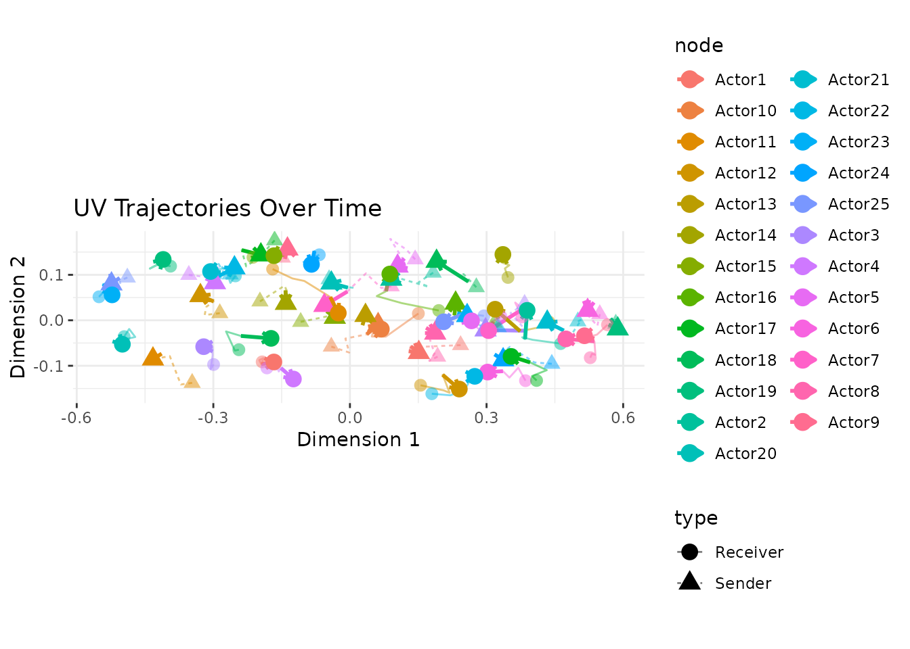
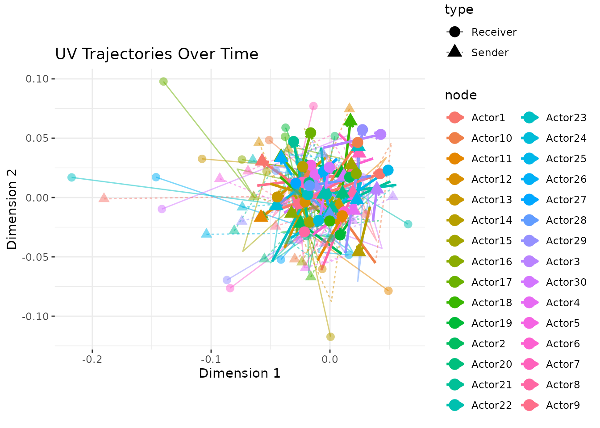
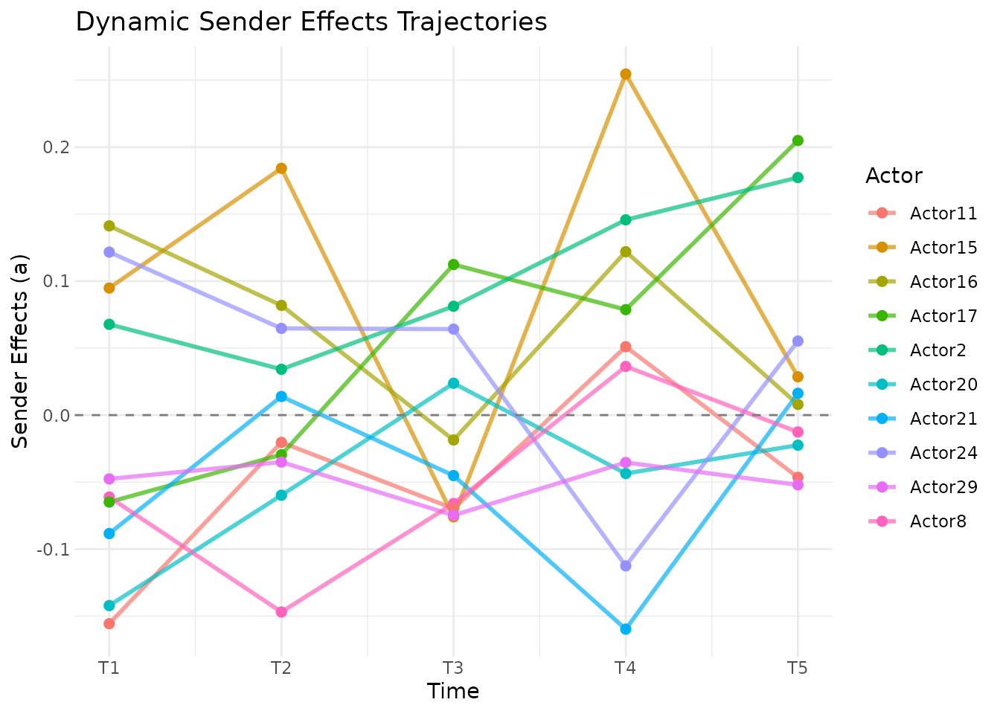

# Dynamic Effects in Longitudinal AME Models

## Introduction

Networks change. Countries that were close allies a decade ago may have
drifted apart. A legislator’s co-sponsorship patterns shift as they gain
seniority or switch committee assignments. A user’s purchasing habits
evolve as their tastes change.

The standard AME model assumes that each actor has a fixed latent
position and fixed additive effects across all time periods. This is a
reasonable starting point (pooling across time gives you more data and
more precise estimates), but it can miss important dynamics. The `lame`
package provides two mechanisms for letting the model capture temporal
change: `dynamic_uv` for time-varying latent positions and `dynamic_ab`
for time-varying additive effects.

This vignette explains what these options do, when to use them, and how
to interpret the results.

## What Are Dynamic Effects?

### The Static Baseline

In the standard AME model for longitudinal data, the tie between actors
$i$ and $j$ at time $t$ is:

$$y_{ij,t} = \beta\prime x_{ij,t} + a_{i} + b_{j} + u_{i}\prime v_{j} + \epsilon_{ij,t}$$

The covariates ($x_{ij,t}$) can vary over time, but everything else (the
sender effect $a_{i}$, the receiver effect $b_{j}$, and the latent
positions $u_{i}$ and $v_{j}$) is constant. This means the model assumes
that a country’s tendency to sanction others, or its position in the
latent “sanctioning space,” is the same in 1993 as in 2000.

### Dynamic Latent Positions (`dynamic_uv = TRUE`)

When you set `dynamic_uv = TRUE`, each actor’s latent position evolves
over time according to an AR(1) process:

$$U_{i,k,t} = \rho_{uv}\, U_{i,k,t - 1} + \epsilon_{i,k,t}$$$$V_{j,k,t} = \rho_{uv}\, V_{j,k,t - 1} + \eta_{j,k,t}$$

The autoregressive parameter $\rho_{uv}$ controls how persistent the
positions are. A value close to 1 means positions change slowly, as last
year’s position is a strong predictor of this year’s. A value close to 0
means positions are essentially re-drawn each period. In practice,
$\rho_{uv}$ is estimated from the data, so you don’t need to choose it
yourself.

This is useful when you believe the underlying community structure is
evolving: alliances shift, social groups re-form, trading blocs realign.

### Dynamic Additive Effects (`dynamic_ab = TRUE`)

When you set `dynamic_ab = TRUE`, the sender and receiver effects evolve
over time:

$$a_{i,t} = \rho_{ab}\, a_{i,t - 1} + \epsilon_{i,t}$$$$b_{j,t} = \rho_{ab}\, b_{j,t - 1} + \eta_{j,t}$$

This captures changes in actors’ overall activity levels. A country
might become a more active sanctioner after a change in government. A
student might become more or less socially active across semesters.
These are changes in how much an actor participates, not in who they
connect with (that’s what `dynamic_uv` captures).

You can use either option alone or combine them. In practice,
`dynamic_ab` is often a good place to start, since changes in overall
activity are common and relatively easy to estimate. `dynamic_uv` adds
more flexibility but also more parameters.

### Prior Specifications

The AR(1) coefficients and innovation variances have sensible default
priors:

- $\rho_{uv} \sim \text{TruncNormal}(0.9,0.1,0,1)$, centered on high
  persistence
- $\rho_{ab} \sim \text{TruncNormal}(0.8,0.15,0,1)$, slightly less
  persistent
- $\sigma_{uv}^{2},\sigma_{ab}^{2} \sim \text{InverseGamma}(2,1)$

These can be customized via the `prior` argument if you have strong
beliefs about the rate of change.

## Genuine Dynamics: What They Look Like

We start with an example where dynamics are truly present, so you can
see what the model recovers when there is a real signal. We simulate 25
actors over 5 periods where each actor’s latent position evolves via an
AR(1) process with $\rho = 0.85$. We use stronger latent positions (SD =
1.5) and a negative intercept to produce a network with realistic
density (roughly 30%).

``` r
library(lame)
set.seed(6886)

n_dyn <- 25
n_per <- 5
R_dyn <- 2

# evolving latent positions with AR(1) dynamics
U <- matrix(rnorm(n_dyn * R_dyn, 0, 1.5), n_dyn, R_dyn)
V <- matrix(rnorm(n_dyn * R_dyn, 0, 1.5), n_dyn, R_dyn)

Y_dyn <- list()
for(t in 1:n_per) {
    if(t > 1) {
        U <- 0.85 * U + matrix(rnorm(n_dyn * R_dyn, 0, 0.3), n_dyn, R_dyn)
        V <- 0.85 * V + matrix(rnorm(n_dyn * R_dyn, 0, 0.3), n_dyn, R_dyn)
    }
    eta <- -1 + U %*% t(V)
    Y_t <- matrix(rbinom(n_dyn * n_dyn, 1, pnorm(eta)), n_dyn, n_dyn)
    diag(Y_t) <- NA
    rownames(Y_t) <- colnames(Y_t) <- paste0("A", 1:n_dyn)
    Y_dyn[[t]] <- Y_t
}

# note: iterations are reduced for vignette speed.
# use burn >= 1000 and nscan >= 5000 for real analyses.
fit_dyn_real <- lame(Y_dyn, R = 2,
    dynamic_uv = TRUE, dynamic_ab = TRUE,
    family = "binary",
    burn = 100, nscan = 2500, odens = 25,
    verbose = FALSE, plot = FALSE)

summary(fit_dyn_real)
#> 
#> === Longitudinal AME Model Summary ===
#> 
#> Call:
#> NULL
#> 
#> Time periods: 5 
#> Family: binary 
#> Mode: unipartite 
#> Dynamic latent positions: enabled (rho_uv = 0.946 )
#> Dynamic additive effects: enabled (rho_ab = 0.403 )
#> 
#> Regression coefficients:
#> ------------------------
#>           Estimate StdError z_value p_value CI_lower CI_upper    
#> intercept   -0.746    0.162  -4.599       0   -1.004   -0.428 ***
#> ---
#> Signif. codes: 0 '***' 0.001 '**' 0.01 '*' 0.05 '.' 0.1 ' ' 1
#> Note: p-values are approximate (posterior mean / SD); use credible intervals for inference.
#> 
#> Variance components:
#> -------------------
#>     Estimate StdError
#> va     0.125    0.085
#> cab    0.061    0.078
#> vb     0.132    0.081
#> rho    0.213    0.116
#> ve     1.000    0.000
#>   (va = sender, cab = sender-receiver covariance, vb = receiver,
#>    rho = dyadic correlation, ve = residual variance)
```

The trajectory plot shows how actors move through the latent space over
time. With genuine temporal structure, the paths should show coherent
movement rather than random jumping:

``` r
uv_plot(fit_dyn_real, plot_type = "trajectory")
```



Always check convergence. Dynamic models have more parameters than
static models, so adequate mixing is harder to achieve and requires
longer chains:

``` r
trace_plot(fit_dyn_real)
```


## What Happens Without Temporal Structure?

To understand how the dynamic model behaves when there is no signal, we
fit the same model to independent networks (no temporal correlation).
This is a useful null baseline: the estimated `rho` values tell you what
the prior alone produces when the data are uninformative.

``` r
set.seed(6886)
n <- 30
n_periods <- 5

# independent binary networks with no temporal structure
Y_list <- list()
for(t in 1:n_periods) {
    Y_t <- matrix(rbinom(n*n, 1, 0.2), n, n)
    diag(Y_t) <- NA
    rownames(Y_t) <- colnames(Y_t) <- paste0("Actor", 1:n)
    Y_list[[t]] <- Y_t
}

# fit with a custom prior on rho_uv to illustrate prior sensitivity
prior_custom <- list(
    rho_uv_mean = 0.95,    # expect very slow change in latent positions
    rho_uv_sd = 0.05       # tight prior
)

fit_null <- lame(
    Y = Y_list,
    R = 2,
    dynamic_uv = TRUE,
    dynamic_ab = TRUE,
    family = "binary",
    prior = prior_custom,
    burn = 100,
    nscan = 2500,
    odens = 25,
    verbose = FALSE,
    plot = FALSE
)

summary(fit_null)
#> 
#> === Longitudinal AME Model Summary ===
#> 
#> Call:
#> NULL
#> 
#> Time periods: 5 
#> Family: binary 
#> Mode: unipartite 
#> Dynamic latent positions: enabled (rho_uv = 0.107 )
#> Dynamic additive effects: enabled (rho_ab = 0.478 )
#> 
#> Regression coefficients:
#> ------------------------
#>           Estimate StdError z_value p_value CI_lower CI_upper    
#> intercept   -0.863    0.146   -5.92       0   -1.174   -0.608 ***
#> ---
#> Signif. codes: 0 '***' 0.001 '**' 0.01 '*' 0.05 '.' 0.1 ' ' 1
#> Note: p-values are approximate (posterior mean / SD); use credible intervals for inference.
#> 
#> Variance components:
#> -------------------
#>     Estimate StdError
#> va     0.076    0.043
#> cab    0.024    0.039
#> vb     0.073    0.044
#> rho    0.196    0.077
#> ve     1.000    0.000
#>   (va = sender, cab = sender-receiver covariance, vb = receiver,
#>    rho = dyadic correlation, ve = residual variance)
```

We can compare the estimated persistence parameters across the two
settings:

``` r
cat("Independent data rho_uv:", round(mean(fit_null$rho_uv), 3), "\n")
#> Independent data rho_uv: 0.107
cat("Correlated data rho_uv:", round(mean(fit_dyn_real$rho_uv), 3), "\n")
#> Correlated data rho_uv: 0.946
```

With only 5 time periods, the `rho_uv` estimates may be similar in both
cases. This is expected: the AR(1) parameter is identified from the
correlation of latent positions across adjacent time periods, and 5 time
points provide very little information to update the prior. In real
applications with 10 or more time periods, the difference between
genuine dynamics and independent data becomes much clearer. The key
diagnostic here is the trajectory plot (compare the coherent paths above
with the erratic paths below) rather than the point estimate of `rho`.

### Visualizing the Null Case

The trajectory plot for independent data looks different: paths are more
erratic, without the smooth coherence of genuinely correlated positions.

``` r
uv_plot(fit_null, plot_type = "trajectory")
```



The additive effects show similar behavior. Without genuine temporal
structure, the trajectories reflect noise rather than real shifts in
actor activity.

``` r
ab_plot(fit_null, effect = "sender", plot_type = "trajectory")
#> ℹ Showing top 5 and bottom 5 actors by average effect
#> → Use `show_actors` to specify actors to display
```



## Comparing Model Specifications

A natural workflow is to fit several specifications and compare their
goodness-of-fit. We use the independent data from above to show that
dynamic effects add nothing when there is no signal.

``` r
# static model (no dynamic effects)
fit_static <- lame(Y_list, R = 2, family = "binary",
                                    burn = 100, nscan = 2500, odens = 25,
                                    verbose = FALSE, plot = FALSE)

# dynamic latent positions only
fit_uv <- lame(Y_list, R = 2, dynamic_uv = TRUE, family = "binary",
                            burn = 100, nscan = 2500, odens = 25,
                            verbose = FALSE, plot = FALSE)

# dynamic additive effects only
fit_ab <- lame(Y_list, R = 2, dynamic_ab = TRUE, family = "binary",
                            burn = 100, nscan = 2500, odens = 25,
                            verbose = FALSE, plot = FALSE)

# full dynamic
fit_full <- lame(Y_list, R = 2, dynamic_uv = TRUE, dynamic_ab = TRUE,
                                family = "binary",
                                burn = 100, nscan = 2500, odens = 25,
                                verbose = FALSE, plot = FALSE)
```

Compare the GOF statistics across models. For each specification, we
compute posterior predictive p-values: how often do the simulated
network statistics exceed the observed ones? Values near 0.5 indicate
good fit.

``` r
# compute p-values for each model and each GOF statistic
compute_pvals <- function(fit) {
    gof <- fit$GOF
    sapply(names(gof), function(stat) {
        mat <- gof[[stat]]
        obs <- mat[, 1]           # first column = observed
        sims <- mat[, -1]         # remaining = posterior predictive
        mean(colMeans(sims) >= mean(obs))
    })
}

gof_comparison <- rbind(
    Static     = compute_pvals(fit_static),
    Dynamic_UV = compute_pvals(fit_uv),
    Dynamic_AB = compute_pvals(fit_ab),
    Full       = compute_pvals(fit_full)
)
round(gof_comparison, 3)
#>            sd.rowmean sd.colmean dyad.dep cycle.dep trans.dep
#> Static           0.90       0.97     0.50      0.57      0.34
#> Dynamic_UV       0.92       0.99     0.51      0.55      0.31
#> Dynamic_AB       0.98       1.00     0.94      0.31      0.34
#> Full             0.87       0.88     0.87      0.39      0.33
```

Since the data were generated without temporal structure, the static
model should fit as well as or better than the dynamic models. If you
see similar p-values across specifications, that confirms the dynamic
parameters are not needed here.

## When to Use Dynamic Effects

**Use `dynamic_ab`** when you suspect actors’ overall activity levels
change over time. This is common in many settings: countries go through
isolationist vs. interventionist phases, users churn in and out of
platforms, students become more or less engaged across semesters.

**Use `dynamic_uv`** when you suspect the underlying community structure
is shifting. This is a stronger claim, not just that actors are more or
less active, but that the pattern of *who connects with whom* is
changing. Examples include political realignment, market disruption, or
generational turnover in a social network.

**Use both** when you believe both types of change are happening. This
is the most flexible specification but also the most data-hungry. With
short panels (few time periods) or sparse networks, the dynamic
parameters may not be well-identified, and you might be better off with
the static model.

**Stick with static** when you have few time periods, when the network
structure is genuinely stable, or when you primarily care about the
covariate effects (which are the same across specifications) rather than
the latent structure.

## Dealing with Rotational Indeterminacy

One subtlety of dynamic latent space models: the latent space is only
identified up to rotation at each time point. This means that even if
actor positions are evolving smoothly, the raw estimated $U_{t}$
matrices might appear to “jump” between time periods due to arbitrary
rotations.

The
[`procrustes_align()`](https://netify-dev.github.io/lame/reference/procrustes_align.md)
function solves this by applying Procrustes rotation to align each time
period’s positions to the previous one:

``` r
# align latent positions across time
aligned <- procrustes_align(fit_null)
str(aligned$U)  # 3D array: actors x dimensions x time
#>  num [1:30, 1:2, 1:5] -0.1902 -0.0241 0.053 -0.0206 -0.0927 ...
#>  - attr(*, "dimnames")=List of 3
#>   ..$ : chr [1:30] "Actor1" "Actor2" "Actor3" "Actor4" ...
#>   ..$ : NULL
#>   ..$ : NULL
```

You can also extract aligned positions as a tidy data frame using
[`latent_positions()`](https://netify-dev.github.io/lame/reference/latent_positions.md)
with `align = TRUE` (the default for `lame` objects):

``` r
lp <- latent_positions(fit_null, align = TRUE)
head(lp)
#>    actor dimension time        value posterior_sd type
#> 1 Actor1         1    1 -0.190176494           NA    U
#> 2 Actor2         1    1 -0.024138992           NA    U
#> 3 Actor3         1    1  0.052951908           NA    U
#> 4 Actor4         1    1 -0.020587659           NA    U
#> 5 Actor5         1    1 -0.092732549           NA    U
#> 6 Actor6         1    1 -0.004833171           NA    U
```

This data frame is ready for `ggplot2` if you want to build custom
trajectory plots (e.g., highlighting specific actors or overlaying
external events).

## Implementation Notes

The dynamic effects are implemented in C++ via Rcpp and RcppArmadillo.
The AR(1) updates use Gibbs sampling with block updates across all
actors at each time point, which is efficient for large networks.

## References

1.  **Hoff, PD (2021)**. Additive and Multiplicative Effects Network
    Models. *Statistical Science* 36, 34–50.

2.  **Sewell, D. K., & Chen, Y. (2015)**. Latent space models for
    dynamic networks. *Journal of the American Statistical Association*,
    110(512), 1646-1657.

3.  **Durante, D., & Dunson, D. B. (2014)**. Nonparametric Bayes dynamic
    modeling of relational data. *Biometrika*, 101(4), 883-898.
