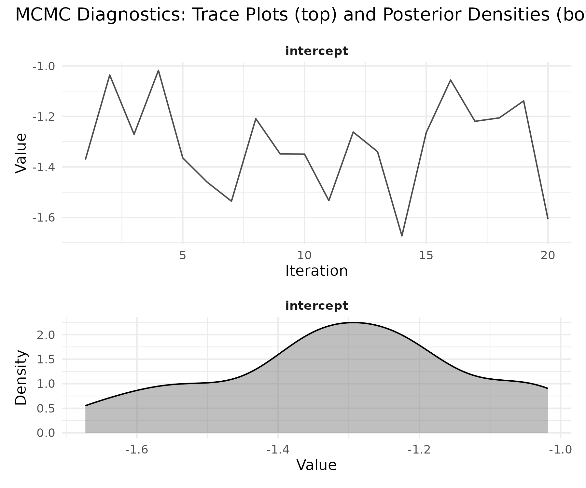
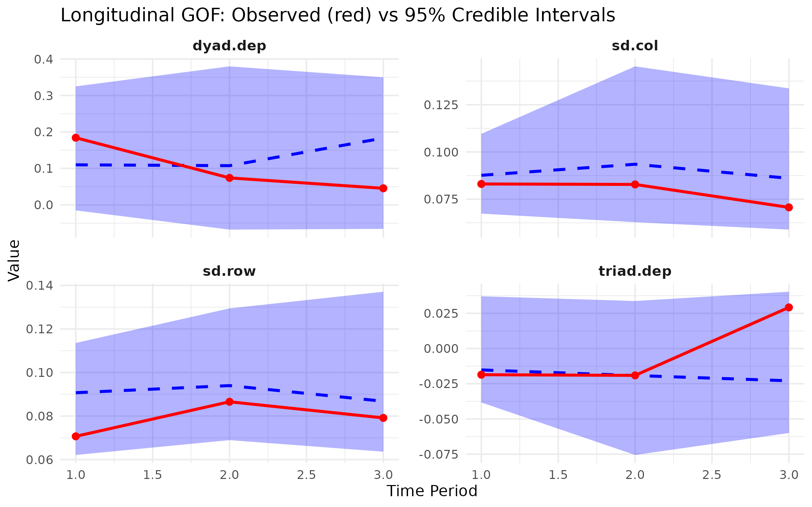
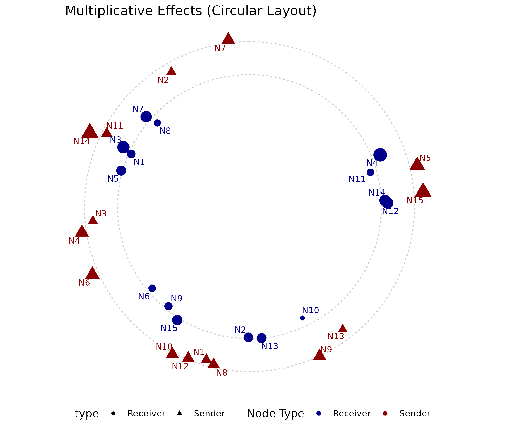
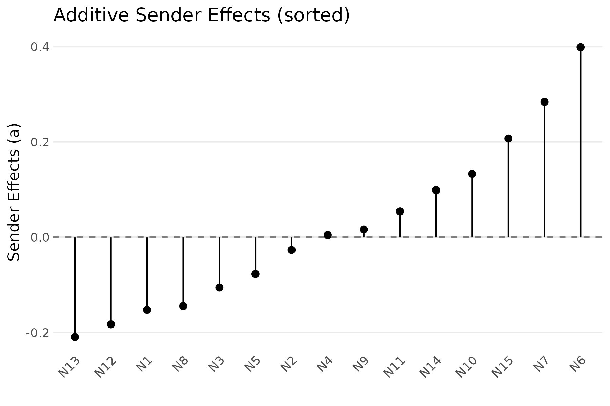

# Introduction to LAME

## Overview

The `lame` package implements Additive and Multiplicative Effects (AME)
models for both cross-sectional and longitudinal network data. It
extends the AME framework (Hoff 2021) to handle temporal dependencies
through dynamic latent factors and additive effects, with a C++ backend
for efficient computation.

### Key Features

- **Cross-sectional and longitudinal** network analysis via
  [`ame()`](https://netify-dev.github.io/lame/reference/ame.md) and
  [`lame()`](https://netify-dev.github.io/lame/reference/lame.md)
- **Dynamic effects**: time-varying additive and multiplicative effects
  with AR(1) processes
- **Bipartite networks**: two-mode networks with separate row and column
  latent spaces
- **Multiple families**: normal, binary, ordinal, poisson, tobit,
  censored binary, fixed rank nomination, and row-ranked likelihood
- **S3 methods**: [`coef()`](https://rdrr.io/r/stats/coef.html),
  [`vcov()`](https://rdrr.io/r/stats/vcov.html),
  [`confint()`](https://rdrr.io/r/stats/confint.html),
  [`residuals()`](https://rdrr.io/r/stats/residuals.html),
  [`predict()`](https://rdrr.io/r/stats/predict.html),
  [`summary()`](https://rdrr.io/r/base/summary.html),
  [`print()`](https://rdrr.io/r/base/print.html)

## Quick Start

``` r
library(lame)
set.seed(6886)
```

### Simulating Network Data

We begin by generating a small directed binary network observed over 3
time periods.

``` r
n <- 15
T_periods <- 3

Y_list <- lapply(1:T_periods, function(t) {
  Y <- matrix(rbinom(n * n, 1, 0.15), n, n)
  diag(Y) <- NA
  rownames(Y) <- colnames(Y) <- paste0("N", 1:n)
  Y
})

cat("Network dimensions:", n, "x", n, "\n")
#> Network dimensions: 15 x 15
cat("Time periods:", T_periods, "\n")
#> Time periods: 3
cat("Densities:", round(sapply(Y_list, mean, na.rm = TRUE), 3), "\n")
#> Densities: 0.133 0.171 0.081
```

### Fitting a Longitudinal Model

The [`lame()`](https://netify-dev.github.io/lame/reference/lame.md)
function fits the longitudinal AME model using MCMC:

``` r
fit <- lame(
  Y = Y_list,
  R = 2,               # 2-dimensional latent space
  family = "binary",   # binary (probit) networks
  rvar = TRUE,         # sender random effects
  cvar = TRUE,         # receiver random effects
  burn = 100,          # burn-in (use 1000+ in practice)
  nscan = 500,         # post-burn-in iterations (use 5000+ in practice)
  odens = 25,          # thinning interval
  print = FALSE,
  plot = FALSE
)
```

### Inspecting the Fit

``` r
summary(fit)
#> 
#> === Longitudinal AME Model Summary ===
#> 
#> Call:
#> NULL
#> 
#> Time periods: 3 
#> Family: binary 
#> Mode: unipartite 
#> 
#> Regression coefficients:
#> ------------------------
#>           Estimate StdError z_value p_value CI_lower CI_upper    
#> intercept   -1.313    0.184  -7.136       0   -1.674   -0.952 ***
#> ---
#> Signif. codes: 0 '***' 0.001 '**' 0.01 '*' 0.05 '.' 0.1 ' ' 1
#> 
#> Variance components:
#> -------------------
#>     Estimate StdError
#> va     0.117    0.048
#> cab    0.002    0.041
#> vb     0.098    0.033
#> rho    0.327    0.170
#> ve     1.000    0.000
#>   (va = sender, cab = sender-receiver covariance, vb = receiver,
#>    rho = dyadic correlation, ve = residual variance)
```

## S3 Methods

The package provides standard R methods for extracting results from
fitted models.

### Regression Coefficients

``` r
# posterior means
coef(fit)
#> intercept 
#> -1.313094

# posterior covariance matrix of regression coefficients
vcov(fit)
#>            intercept
#> intercept 0.03386323

# 95% Bayesian credible intervals (not confidence intervals)
confint(fit)
#>                2.5%     97.5%
#> intercept -1.641639 -1.026529

# narrower 90% intervals
confint(fit, level = 0.90)
#>                  5%       95%
#> intercept -1.610374 -1.035143
```

### Predictions and Residuals

``` r
# predicted probabilities (response scale) -- returns list for lame objects
Y_hat <- predict(fit, type = "response")
cat("Predicted probability range:", round(range(unlist(Y_hat), na.rm = TRUE), 3), "\n")
#> Predicted probability range: 0.014 0.602

# residuals (observed - fitted) -- returns list for lame objects
resid_list <- residuals(fit)
cat("Residual SD:", round(sd(unlist(resid_list), na.rm = TRUE), 3), "\n")
#> Residual SD: 0.351
```

## Cross-Sectional Analysis

For a single network observed at one time point, use
[`ame()`](https://netify-dev.github.io/lame/reference/ame.md):

``` r
fit_cs <- ame(
  Y = Y_list[[1]],
  R = 2,
  family = "binary",
  burn = 100,
  nscan = 500,
  odens = 25,
  print = FALSE
)

summary(fit_cs)
#> 
#> === AME Model Summary ===
#> 
#> Call:
#> [1] "Y ~ intercept + a[i] + b[j] + rho*e[ji] + U[i,1:2] %*% V[j,1:2], family = 'binary'"
#> 
#> Regression coefficients:
#> ------------------------
#>           Estimate StdError z_value p_value CI_lower CI_upper    
#> intercept   -1.211    0.129   -9.38       0   -1.463   -0.958 ***
#> ---
#> Signif. codes: 0 '***' 0.001 '**' 0.01 '*' 0.05 '.' 0.1 ' ' 1
#> 
#> Variance components:
#> -------------------
#>     Estimate StdError
#> va     0.110    0.045
#> cab    0.008    0.042
#> vb     0.140    0.062
#> rho    0.330    0.162
#> ve     1.000    0.000
#>   (va = sender, cab = sender-receiver covariance, vb = receiver,
#>    rho = dyadic correlation, ve = residual variance)
coef(fit_cs)
#> intercept 
#>  -1.21051
```

## Dynamic Effects

The [`lame()`](https://netify-dev.github.io/lame/reference/lame.md)
function supports time-varying sender/receiver effects and latent
positions via AR(1) processes.

``` r
fit_dyn <- lame(
  Y = Y_list,
  R = 2,
  dynamic_ab = TRUE,   # time-varying sender/receiver effects
  dynamic_uv = TRUE,   # time-varying latent positions

  family = "binary",
  burn = 100,
  nscan = 500,
  odens = 25,
  print = FALSE,
  plot = FALSE
)

summary(fit_dyn)
#> 
#> === Longitudinal AME Model Summary ===
#> 
#> Call:
#> NULL
#> 
#> Time periods: 3 
#> Family: binary 
#> Mode: unipartite 
#> Dynamic latent positions: enabled (rho_uv = 0.322 )
#> Dynamic additive effects: enabled (rho_ab = 0.294 )
#> 
#> Regression coefficients:
#> ------------------------
#>           Estimate StdError z_value p_value CI_lower CI_upper    
#> intercept   -1.199    0.158  -7.572       0   -1.509   -0.889 ***
#> ---
#> Signif. codes: 0 '***' 0.001 '**' 0.01 '*' 0.05 '.' 0.1 ' ' 1
#> 
#> Variance components:
#> -------------------
#>     Estimate StdError
#> va     0.114    0.058
#> cab    0.042    0.050
#> vb     0.123    0.051
#> rho    0.378    0.120
#> ve     1.000    0.000
#>   (va = sender, cab = sender-receiver covariance, vb = receiver,
#>    rho = dyadic correlation, ve = residual variance)
```

## Visualizing Results

### MCMC Diagnostics

Trace plots help assess convergence of the MCMC sampler:

``` r
trace_plot(fit, params = "beta")
```



### Goodness of Fit

GOF plots compare observed network statistics to their posterior
predictive distributions:

``` r
gof_plot(fit)
```



### Latent Space

The
[`uv_plot()`](https://netify-dev.github.io/lame/reference/uv_plot.md)
function visualizes the estimated latent positions:

``` r
uv_plot(fit)
```



### Additive Effects

The
[`ab_plot()`](https://netify-dev.github.io/lame/reference/ab_plot.md)
function shows sender and receiver random effects:

``` r
ab_plot(fit, effect = "sender")
```



## Model Families

The package supports 8 distributional families:

| Family      | Description           | Use case                    |
|-------------|-----------------------|-----------------------------|
| `"normal"`  | Gaussian              | Continuous valued networks  |
| `"binary"`  | Probit                | Binary networks (0/1)       |
| `"ordinal"` | Ordinal probit        | Ordered categorical ties    |
| `"poisson"` | Poisson               | Count networks              |
| `"tobit"`   | Censored normal       | Non-negative continuous     |
| `"cbin"`    | Censored binary       | Binary with censoring       |
| `"frn"`     | Fixed rank nomination | Fixed number of nominations |
| `"rrl"`     | Row-ranked likelihood | Ranked preferences          |

## Bipartite Networks

For two-mode networks with different row and column node sets, set
`mode = "bipartite"`:

``` r
# simulate a small bipartite network
nA <- 10; nB <- 8
Y_bip <- lapply(1:3, function(t) {
  Y <- matrix(rbinom(nA * nB, 1, 0.2), nA, nB)
  rownames(Y) <- paste0("R", 1:nA)
  colnames(Y) <- paste0("C", 1:nB)
  Y
})

fit_bip <- lame(
  Y = Y_bip,
  mode = "bipartite",
  R = 2,
  family = "binary",
  burn = 100,
  nscan = 500,
  odens = 25,
  print = FALSE,
  plot = FALSE
)

summary(fit_bip)
#> 
#> === Longitudinal AME Model Summary ===
#> 
#> Call:
#> NULL
#> 
#> Time periods: 3 
#> Family: binary 
#> Mode: bipartite 
#> 
#> Regression coefficients:
#> ------------------------
#>           Estimate StdError z_value p_value CI_lower CI_upper   
#> intercept   -0.926    0.291  -3.183   0.001   -1.496   -0.356 **
#> ---
#> Signif. codes: 0 '***' 0.001 '**' 0.01 '*' 0.05 '.' 0.1 ' ' 1
#> 
#> Variance components:
#> -------------------
#>     Estimate StdError
#> va     0.785    0.413
#> cab    0.000    0.000
#> vb     0.715    0.297
#> rho    0.000    0.000
#> ve     1.000    0.000
#>   (va = sender, cab = sender-receiver covariance, vb = receiver,
#>    rho = dyadic correlation, ve = residual variance)
```

## References

Hoff, PD (2021). Additive and Multiplicative Effects Network Models.
*Statistical Science*, 36, 34–50.

Minhas, S., Dorff, C., Gallop, M. B., Foster, M., Liu, H., Tellez, J., &
Ward, M. D. (2022). Taking dyads seriously. *Political Science Research
and Methods*, 10(4), 703–721.
