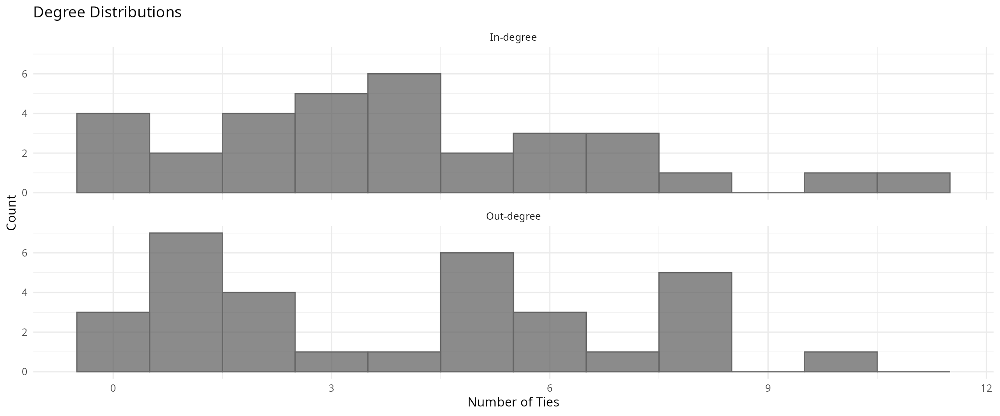
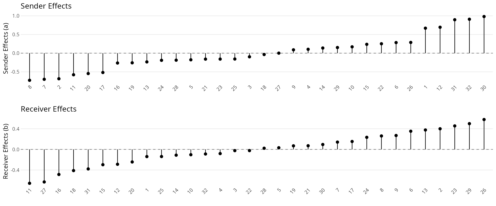
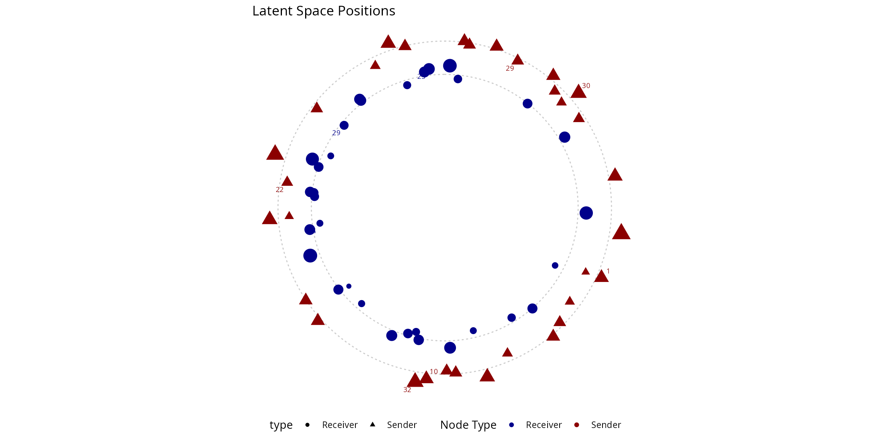
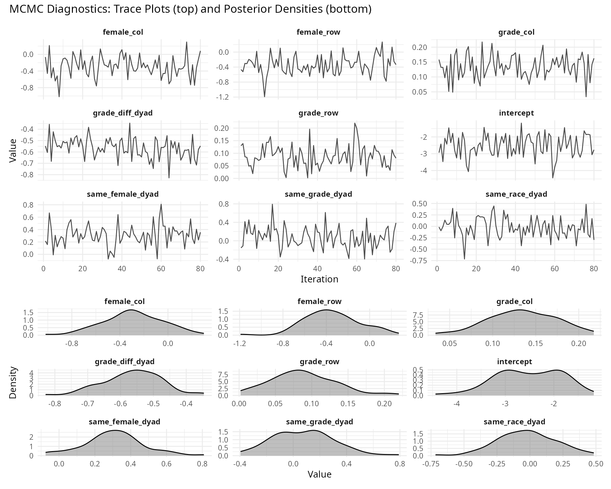
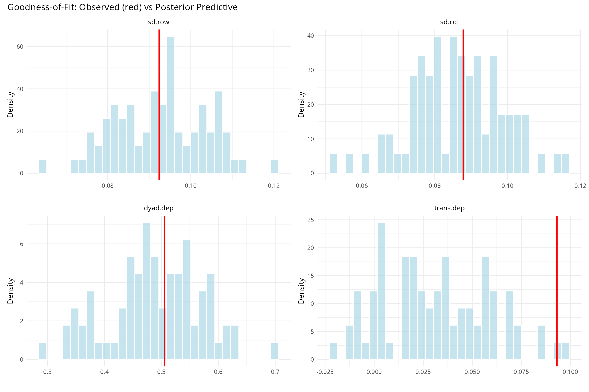
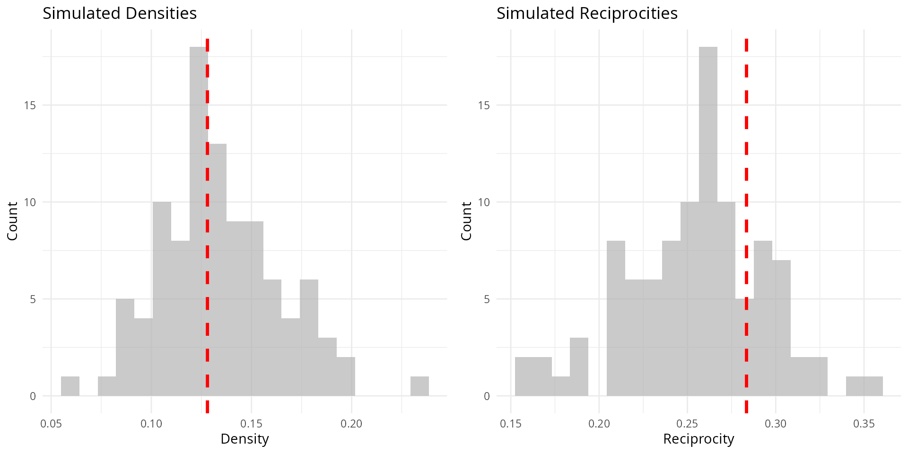

# Static AME Models: Theory and Application

## Introduction

The Additive and Multiplicative Effects (AME) model provides a framework
for analyzing network data while accounting for the complex dependencies
inherent in relational observations. This vignette demonstrates the use
of static AME models with the `lame` package.

### Network Dependencies

Standard regression models assume independent observations, but network
data violates this assumption in several ways:

1.  **Row dependencies**: Individuals vary in their propensity to form
    outgoing ties
2.  **Column dependencies**: Individuals vary in their propensity to
    receive ties  
3.  **Dyadic dependencies**: The presence of tie $(i,j)$ may correlate
    with tie $(j,i)$
4.  **Third-order dependencies**: Transitivity and clustering patterns

### Model Specification

The AME model for a network $\mathbf{Y}$ with entries $y_{ij}$ takes the
form:

$$Y_{ij} \sim F\left( \eta_{ij} \right)$$

where $F$ belongs to the exponential family and the linear predictor is:

$$\eta_{ij} = \mu + {\mathbf{β}}^{T}\mathbf{x}_{ij} + a_{i} + b_{j} + \mathbf{u}_{i}^{T}\mathbf{v}_{j} + \epsilon_{ij}$$

#### Model Components

**Fixed Effects:** - $\mu \in {\mathbb{R}}$: intercept term -
${\mathbf{β}} \in {\mathbb{R}}^{p}$: regression coefficients for $p$
covariates - $\mathbf{x}_{ij} \in {\mathbb{R}}^{p}$: covariate vector
for dyad $(i,j)$

**Random Effects:** -
$a_{i} \sim \mathcal{N}\left( 0,\sigma_{a}^{2} \right)$: sender/row
effects - $b_{j} \sim \mathcal{N}\left( 0,\sigma_{b}^{2} \right)$:
receiver/column effects

**Multiplicative Effects:** -
$\mathbf{u}_{i},\mathbf{v}_{j} \in {\mathbb{R}}^{R}$: latent factors in
$R$-dimensional space -
$\mathbf{u}_{i}^{T}\mathbf{v}_{j} = \sum_{r = 1}^{R}u_{ir}v_{jr}$: inner
product capturing latent homophily

**Dyadic Correlation:** $$\begin{pmatrix}
\epsilon_{ij} \\
\epsilon_{ji}
\end{pmatrix} \sim \mathcal{N}\left( \mathbf{0},\begin{pmatrix}
\sigma_{\epsilon}^{2} & {\rho\sigma_{\epsilon}^{2}} \\
{\rho\sigma_{\epsilon}^{2}} & \sigma_{\epsilon}^{2}
\end{pmatrix} \right)$$

where $\rho$ captures reciprocity.

### Estimation

The package uses Bayesian inference via MCMC to sample from the
posterior distribution:

$$p\left( {\mathbf{θ}}|\mathbf{Y} \right) \propto p\left( \mathbf{Y}|{\mathbf{θ}} \right) \cdot p({\mathbf{θ}})$$

where $\mathbf{θ}$ contains all model parameters.

## Data Analysis Example

This section analyzes friendship networks from the AddHealth study using
the AME framework.

``` r
library(lame)
library(ggplot2)
library(gridExtra)
library(reshape2)
set.seed(123)

# Load data
data(addhealthc3)
# Convert valued network to binary (Y > 0 indicates a friendship)
Y <- (addhealthc3$Y > 0) * 1
X_nodes <- addhealthc3$X  

# Network dimensions
n <- nrow(Y)
n_edges <- sum(Y, na.rm = TRUE)
density <- mean(Y, na.rm = TRUE)

# Basic statistics
out_degree <- rowSums(Y, na.rm = TRUE)
in_degree <- colSums(Y, na.rm = TRUE)
reciprocal_pairs <- sum(Y * t(Y), na.rm = TRUE) / 2
reciprocity <- reciprocal_pairs / sum(Y, na.rm = TRUE)

# Create a summary table
network_stats <- data.frame(
  Statistic = c("Nodes", "Edges", "Density", "Mean degree", "Degree SD", "Reciprocity"),
  Value = c(n, n_edges, round(density, 3), round(mean(out_degree), 2), 
            round(sd(out_degree), 2), round(reciprocity, 3))
)
knitr::kable(network_stats, caption = "Network Statistics")
```

| Statistic   |   Value |
|:------------|--------:|
| Nodes       |  32.000 |
| Edges       | 127.000 |
| Density     |   0.128 |
| Mean degree |   3.970 |
| Degree SD   |   2.960 |
| Reciprocity |   0.283 |

Network Statistics

### Covariate Construction

Dyadic covariates capture homophily and heterophily patterns:

``` r
# Homophily indicators: I(x_i = x_j)
same_female <- outer(X_nodes[,"female"], X_nodes[,"female"], "==") * 1
same_race <- outer(X_nodes[,"race"], X_nodes[,"race"], "==") * 1
same_grade <- outer(X_nodes[,"grade"], X_nodes[,"grade"], "==") * 1

# Absolute difference: |x_i - x_j|
grade_diff <- abs(outer(X_nodes[,"grade"], X_nodes[,"grade"], "-"))

# Combine covariates
Xdyad <- array(NA, dim = c(n, n, 4))
Xdyad[,,1] <- same_female
Xdyad[,,2] <- same_race  
Xdyad[,,3] <- same_grade
Xdyad[,,4] <- grade_diff
dimnames(Xdyad)[[3]] = c('same_female', 'same_race', 'same_grade', 'grade_diff')

# Remove diagonal
for(k in 1:4) diag(Xdyad[,,k]) <- NA

# Nodal covariates
Xrow <- X_nodes[, c("female", "grade")]
Xcol <- X_nodes[, c("female", "grade")]

# Covariate summary
cov_stats <- data.frame(
  Covariate = c("Same gender", "Same race", "Same grade", "Grade difference"),
  Mean = round(c(mean(same_female, na.rm=TRUE), 
                 mean(same_race, na.rm=TRUE),
                 mean(same_grade, na.rm=TRUE),
                 mean(grade_diff, na.rm=TRUE)), 3)
)
knitr::kable(cov_stats, caption = "Dyadic Covariate Rates")
```

| Covariate        |  Mean |
|:-----------------|------:|
| Same gender      | 0.500 |
| Same race        | 0.709 |
| Same grade       | 0.170 |
| Grade difference | 2.019 |

Dyadic Covariate Rates

### Descriptive Visualization

``` r
# Degree distributions
degree_df <- data.frame(
  Degree = c(out_degree, in_degree),
  Type = rep(c("Out-degree", "In-degree"), each = n)
)

ggplot(degree_df, aes(x = Degree)) +
  geom_histogram(binwidth = 1, alpha = 0.7, color='grey40') +
  facet_wrap(~Type, ncol=1) +
  labs(title = "Degree Distributions",
       x = "Number of Ties", y = "Count") +
  theme_minimal() +
  theme(legend.position = "none")
```



## Model Fitting

The full model includes fixed effects for covariates, random effects for
individual heterogeneity, and multiplicative effects for latent
structure:

$$\Phi^{- 1}\left( P\left( Y_{ij} = 1 \right) \right) = \mu + \sum\limits_{k = 1}^{4}\beta_{k}^{\text{dyad}}x_{ij}^{(k)} + \sum\limits_{k = 1}^{2}\beta_{k}^{\text{row}}x_{i}^{(k)} + \sum\limits_{k = 1}^{2}\beta_{k}^{\text{col}}x_{j}^{(k)} + a_{i} + b_{j} + \mathbf{u}_{i}^{T}\mathbf{v}_{j}$$

### Prior Specification

The AME model uses conjugate or weakly informative priors by default.
Custom priors and starting values can be specified:

``` r
# Example: Setting custom priors and starting values

# Prior means for regression coefficients
prior_mean_beta <- rep(0, 9)  # 9 coefficients in our model

# Prior variance (inverse precision) for coefficients  
prior_var_beta <- rep(10, 9)  # Diffuse prior with variance 10

# Prior for variance components
prior_nu <- 3     # Degrees of freedom for inverse-Wishart
prior_s2 <- 1     # Scale for variance components

# Starting values can be specified to improve convergence
# Example: Use OLS-type estimates as starting values
start_intercept <- qnorm(mean(Y, na.rm = TRUE))  # Probit transform of density

# Create prior list
prior_list <- list(
  beta_mean = prior_mean_beta,
  beta_var = prior_var_beta,
  nu = prior_nu,
  s2 = prior_s2
)

# Create starting values list
start_vals <- list(
  beta = c(start_intercept, rep(0, 8)),  # Start other coefficients at 0
  s2a = var(rowMeans(Y, na.rm = TRUE)),  # Row variance from data
  s2b = var(colMeans(Y, na.rm = TRUE)),  # Column variance from data
  rho = 0.1  # Small positive reciprocity
)
```

``` r
# Fit AME model with sufficient iterations for convergence
# Note: prior and start_vals can be passed as arguments
fit <- ame(Y, 
          Xdyad = Xdyad,
          Xrow = Xrow,
          Xcol = Xcol,
          R = 2,            # 2D latent space
          family = "binary",
          rvar = TRUE,      # row variance
          cvar = TRUE,      # column variance
          dcor = TRUE,      # dyadic correlation
          burn = 500,       # burn-in (increase for publication-quality results)
          nscan = 2000,     # sampling iterations
          odens = 25,       # thinning interval
          print = TRUE,
          gof = TRUE
          # prior = prior_list,     # Custom priors (commented out for default)
          # start_vals = start_vals # Custom starting values (commented out)
          )

# Model summary
fit
#> 
#> Additive and Multiplicative Effects (AME) Model
#> ================================================
#> 
#> Network dimensions:  32 x 32 
#> MCMC iterations:  80 
#> Family:  binary 
#> Mode:  unipartite 
#> Symmetric:  FALSE 
#> 
#> Number of parameters:
#>   Regression coefficients:  9 
#>   Row/sender effects: enabled
#>   Column/receiver effects: enabled
#>   Dyadic correlation: enabled
#>   Multiplicative effects dimension:  2 
#> 
#> Use summary(object) for detailed results
```

#### Prior Guidelines

**For regression coefficients ($\mathbf{β}$)**: - Default:
$\beta_{k} \sim \mathcal{N}(0,10)$ (weakly informative) - Informative:
Use smaller variance (e.g., 1) if prior knowledge exists - For binary
networks, coefficients typically range from -3 to 3

**For variance components ($\sigma_{a}^{2},\sigma_{b}^{2}$)**: -
Default: Inverse-Gamma with small shape and scale - Controls
heterogeneity in individual effects - Larger prior variance allows more
individual variation

**For dyadic correlation ($\rho$)**: - Default: Uniform(-1, 1) or
Beta-transformed - Positive values expected for social networks - Can
constrain to \[0, 1\] if reciprocity expected

#### Starting Value Guidelines

Good starting values accelerate convergence:

1.  **Intercept**: Use probit/logit transform of network density
2.  **Covariate effects**: Start at 0 or use GLM estimates
3.  **Variance components**: Use empirical variance of row/column means
4.  **Latent positions**: Random normal or from SVD of residual matrix
5.  **Reciprocity**: Start at observed reciprocity rate

### Model Output

``` r
# Detailed results
model_summary <- summary(fit)

# 
print(model_summary)
#> 
#> === AME Model Summary ===
#> 
#> Call:
#> [1] "Y ~ intercept + dyad(same_female, same_race, same_grade, grade_diff) + row(female, grade) + col(female, grade) + a[i] + b[j] + rho*e[ji] + U[i,1:2] %*% V[j,1:2], family = 'binary'"
#> 
#> Regression coefficients:
#> ------------------------
#>                  Estimate StdError z_value p_value CI_lower CI_upper    
#> intercept          -2.523    0.677  -3.725       0   -3.851   -1.196 ***
#> female_row         -0.347    0.254  -1.362   0.173   -0.845    0.152    
#> grade_row           0.088    0.045   1.972   0.049    0.001    0.176   *
#> female_col         -0.289    0.248  -1.165   0.244   -0.776    0.197    
#> grade_col           0.135    0.039   3.424   0.001    0.058    0.212 ***
#> same_female_dyad    0.305    0.167   1.826   0.068   -0.022    0.633   .
#> same_race_dyad     -0.026    0.222  -0.115   0.908   -0.461     0.41    
#> same_grade_dyad     0.074    0.231   0.322   0.747   -0.378    0.527    
#> grade_diff_dyad    -0.563    0.089  -6.313       0   -0.738   -0.388 ***
#> ---
#> Signif. codes: 0 '***' 0.001 '**' 0.01 '*' 0.05 '.' 0.1 ' ' 1
#> 
#> Variance components:
#> -------------------
#>     Estimate StdError
#> va     0.323    0.106
#> cab    0.012    0.070
#> vb     0.206    0.076
#> rho    0.877    0.065
#> ve     1.000    0.000
#>   (va = sender, cab = sender-receiver covariance, vb = receiver,
#>    rho = dyadic correlation, ve = residual variance)
```

### Coefficient Interpretation

For binary networks with probit link: - A coefficient $\beta$ changes
the probit-scale linear predictor by $\beta$ - At the mean, this
translates to approximately $0.4 \times \beta$ change in probability -
The baseline probability is $\Phi(\mu)$ where $\Phi$ is the standard
normal CDF

### Goodness of Fit

The goodness-of-fit statistics compare observed network features to
those from the posterior predictive distribution:

``` r
# Extract observed and simulated statistics
gof_obs <- fit$GOF[1, ]
gof_sim <- fit$GOF[-1, , drop = FALSE]

# Calculate z-scores for each statistic
gof_mean <- colMeans(gof_sim)
gof_sd <- apply(gof_sim, 2, sd)
gof_z <- (gof_obs - gof_mean) / gof_sd

# Create summary table
gof_summary <- data.frame(
  Statistic = c("Row heterogeneity", "Column heterogeneity", 
                "Dyadic dependence", "Triadic closure", "Transitivity"),
  Observed = round(gof_obs, 3),
  Expected = round(gof_mean, 3),
  SD = round(gof_sd, 3),
  `Z-score` = round(gof_z, 2),
  check.names = FALSE
)

print(knitr::kable(gof_summary, caption = "Goodness-of-Fit Statistics"))
#> 
#> 
#> Table: Goodness-of-Fit Statistics
#> 
#> |           |Statistic            | Observed| Expected|    SD| Z-score|
#> |:----------|:--------------------|--------:|--------:|-----:|-------:|
#> |sd.rowmean |Row heterogeneity    |    0.092|    0.093| 0.011|   -0.04|
#> |sd.colmean |Column heterogeneity |    0.088|    0.086| 0.013|    0.14|
#> |dyad.dep   |Dyadic dependence    |    0.506|    0.489| 0.082|    0.20|
#> |cycle.dep  |Triadic closure      |    0.087|    0.033| 0.027|    1.99|
#> |trans.dep  |Transitivity         |    0.093|    0.032| 0.028|    2.23|
```

``` r
# Extract coefficients (handle different summary formats)
if(!is.null(model_summary$beta)) {
  coef_matrix <- model_summary$beta
  coef_names <- rownames(model_summary$beta)
} else if(!is.null(model_summary$coefficients)) {
  coef_matrix <- model_summary$coefficients
  coef_names <- rownames(model_summary$coefficients)
} else {
  coef_matrix <- NULL
  coef_names <- NULL
}

# Baseline probability
if(!is.null(coef_matrix)) {
  coef_est <- coef_matrix[,1]
  intercept_idx <- grep("intercept|Intercept", coef_names, ignore.case = TRUE)[1]
  if(!is.na(intercept_idx)) {
    mu <- coef_est[intercept_idx]
    baseline_prob <- pnorm(mu)
    cat("Baseline friendship probability: Φ(", round(mu, 3), ") = ", 
        round(baseline_prob, 3), "\n\n", sep="")
  }
}
#> Baseline friendship probability: Φ(-2.523) = 0.006

# Variance interpretation
if(!is.null(model_summary$variance)) {
  var_comp <- model_summary$variance
} else if(!is.null(model_summary$variance_components)) {
  var_comp <- model_summary$variance_components
} else {
  var_comp <- NULL
}

if(!is.null(var_comp)) {
  cat("Heterogeneity in network:\n")
  
  # Handle different row naming conventions
  row_names <- rownames(var_comp)
  
  # Sender variance
  sender_idx <- grep("va", row_names, ignore.case = TRUE)[1]
  if(!is.na(sender_idx)) {
    cat("  Sender variance σ²ₐ =", round(var_comp[sender_idx, 1], 3), 
        "- variation in outgoing ties\n")
  }
  
  # Receiver variance
  receiver_idx <- grep("vb", row_names, ignore.case = TRUE)[1]
  if(!is.na(receiver_idx)) {
    cat("  Receiver variance σ²ᵦ =", round(var_comp[receiver_idx, 1], 3), 
        "- variation in incoming ties\n")
  }
  
  # Reciprocity
  recip_idx <- grep("rho", row_names, ignore.case = TRUE)[1]
  if(!is.na(recip_idx)) {
    cat("  Reciprocity ρ =", round(var_comp[recip_idx, 1], 3), 
        "- correlation between (i,j) and (j,i)\n")
  }
}
#> Heterogeneity in network:
#>   Sender variance σ²ₐ = 0.323 - variation in outgoing ties
#>   Receiver variance σ²ᵦ = 0.206 - variation in incoming ties
#>   Reciprocity ρ = 0.877 - correlation between (i,j) and (j,i)
```

## Individual Effects

The model decomposes individual heterogeneity into sender effects
$a_{i}$ and receiver effects $b_{j}$:

``` r
# Use the built-in ab_plot function for visualizing additive effects
p1 <- ab_plot(fit, effect = "sender", sorted = TRUE, 
              title = "Sender Effects")
p2 <- ab_plot(fit, effect = "receiver", sorted = TRUE,
              title = "Receiver Effects")

grid.arrange(p1, p2, ncol = 1)
```



``` r

# Extract effects for analysis
sender_effects <- fit$APM
receiver_effects <- fit$BPM

# Identify influential nodes
top_send <- order(sender_effects, decreasing = TRUE)[1:5]
top_rec <- order(receiver_effects, decreasing = TRUE)[1:5]

influential_nodes <- data.frame(
  Node = c(top_send[1:3], top_rec[1:3]),
  Type = rep(c("Top Senders", "Top Receivers"), each = 3),
  Effect = round(c(sender_effects[top_send[1:3]], receiver_effects[top_rec[1:3]]), 3),
  Degree = c(out_degree[top_send[1:3]], in_degree[top_rec[1:3]])
)
knitr::kable(influential_nodes, caption = "Most Influential Nodes")
```

|     | Node | Type          | Effect | Degree |
|:----|-----:|:--------------|-------:|-------:|
| 30  |   30 | Top Senders   |  0.981 |     10 |
| 32  |   32 | Top Senders   |  0.909 |      8 |
| 31  |   31 | Top Senders   |  0.895 |      5 |
| 26  |   26 | Top Receivers |  0.579 |      7 |
| 29  |   29 | Top Receivers |  0.499 |     11 |
| 23  |   23 | Top Receivers |  0.455 |     10 |

Most Influential Nodes

## Latent Space

The multiplicative effects $\mathbf{u}_{i}^{T}\mathbf{v}_{j}$ represent
nodes in latent space where proximity indicates affinity:

``` r
# Use the built-in uv_plot function for latent space visualization
# Circle layout showing nodes arranged in a circle
p1 <- uv_plot(fit, layout = "circle", show.edges = FALSE,
              label.nodes = TRUE, label.size = 2.5,
              title = "Latent Space Positions")

# Show the plot
print(p1)
```



``` r

# Extract latent positions for analysis
U <- fit$U  # Sender positions
V <- fit$V  # Receiver positions

# Inner products
UV_products <- U %*% t(V)
cat("\nLatent affinity (uᵢᵀvⱼ) statistics:\n")
#> 
#> Latent affinity (uᵢᵀvⱼ) statistics:
cat("  Range: [", round(min(UV_products), 2), ", ", 
    round(max(UV_products), 2), "]\n", sep="")
#>   Range: [-0.01, 0.01]
cat("  SD:", round(sd(UV_products), 2), "\n")
#>   SD: 0
```

## Model Predictions

``` r
# Generate predictions
pred_link <- predict(fit, type = "link")      # Linear predictor η
pred_resp <- predict(fit, type = "response")  # Probability Φ(η)

# Classification performance
Y_vec <- as.vector(Y)
pred_vec <- as.vector(pred_resp)
keep <- !is.na(Y_vec)

threshold <- 0.5
pred_binary <- (pred_vec > threshold) * 1
confusion <- table(Actual = Y_vec[keep], Predicted = pred_binary[keep])

# Confusion Matrix
knitr::kable(confusion, caption = "Confusion Matrix")
```

|     |   0 |   1 |
|:----|----:|----:|
| 0   | 852 |  13 |
| 1   |  88 |  39 |

Confusion Matrix

``` r

# Metrics
accuracy <- sum(diag(confusion)) / sum(confusion)
sensitivity <- confusion[2,2] / sum(confusion[2,])
specificity <- confusion[1,1] / sum(confusion[1,])
precision <- confusion[2,2] / sum(confusion[,2])

# Performance metrics
performance <- data.frame(
  Metric = c("Accuracy", "Sensitivity", "Specificity", "Precision", "AUC"),
  Value = round(c(accuracy, sensitivity, specificity, precision, NA), 3)
)

# AUC calculation
calc_auc <- function(pred, actual) {
  pos_scores <- pred[actual == 1]
  neg_scores <- pred[actual == 0]
  
  # Count pairs where positive > negative
  correct_pairs <- 0
  total_pairs <- 0
  
  for(pos in pos_scores) {
    for(neg in neg_scores) {
      if(pos > neg) correct_pairs <- correct_pairs + 1
      if(pos == neg) correct_pairs <- correct_pairs + 0.5
      total_pairs <- total_pairs + 1
    }
  }
  
  return(correct_pairs / total_pairs)
}

auc <- calc_auc(pred_vec[keep], Y_vec[keep])
performance$Value[5] <- round(auc, 3)
knitr::kable(performance, caption = "Classification Performance")
```

| Metric      | Value |
|:------------|------:|
| Accuracy    | 0.898 |
| Sensitivity | 0.307 |
| Specificity | 0.985 |
| Precision   | 0.750 |
| AUC         | 0.893 |

Classification Performance

### Model Components

The
[`reconstruct_EZ()`](https://netify-dev.github.io/lame/reference/reconstruct_EZ.md)
and
[`reconstruct_UVPM()`](https://netify-dev.github.io/lame/reference/reconstruct_EZ.md)
functions extract specific model components:

``` r
# Full linear predictor
EZ <- reconstruct_EZ(fit)  # η = μ + βᵀx + a + b + uᵀv

# Multiplicative component only
UVPM <- reconstruct_UVPM(fit)  # uᵀv

# Variance decomposition
variance_decomp <- data.frame(
  Component = c("Total (EZ)", "Multiplicative (UV)", "Proportion from latent"),
  Variance = c(round(var(as.vector(EZ), na.rm=TRUE), 3),
              round(var(as.vector(UVPM), na.rm=TRUE), 3),
              round(var(as.vector(UVPM), na.rm=TRUE) / var(as.vector(EZ), na.rm=TRUE), 3))
)
knitr::kable(variance_decomp, caption = "Linear Predictor Variance Decomposition")
```

| Component              | Variance |
|:-----------------------|---------:|
| Total (EZ)             |    1.048 |
| Multiplicative (UV)    |    0.000 |
| Proportion from latent |    0.000 |

Linear Predictor Variance Decomposition

## Convergence Diagnostics

``` r
# MCMC trace plots using the dedicated trace_plot function
trace_plot(fit, params = "beta", ncol = 3)
```



``` r

# Convergence summary table
conv_summary <- data.frame(
  Property = c("Stored MCMC samples", "Number of coefficients"),
  Value = c(nrow(fit$BETA), ncol(fit$BETA))
)
knitr::kable(conv_summary, caption = "MCMC Summary")
```

| Property               | Value |
|:-----------------------|------:|
| Stored MCMC samples    |    80 |
| Number of coefficients |     9 |

MCMC Summary

## Goodness of Fit

``` r
gof_stats <- fit$GOF
observed <- gof_stats[1,]
simulated <- gof_stats[-1,]

# GOF Statistics table
gof_results <- data.frame(
  Statistic = names(observed),
  Observed = round(observed, 3),
  Expected = round(sapply(1:length(observed), function(i) mean(simulated[,i])), 3),
  SD = round(sapply(1:length(observed), function(i) sd(simulated[,i])), 3),
  Z_score = round(sapply(1:length(observed), function(i) {
    (observed[i] - mean(simulated[,i])) / sd(simulated[,i])
  }), 2),
  P_value = round(sapply(1:length(observed), function(i) {
    2 * min(mean(simulated[,i] <= observed[i]), mean(simulated[,i] >= observed[i]))
  }), 3)
)

# Mark poor fit
gof_results$Fit <- ifelse(abs(gof_results$Z_score) > 2, "Poor", "Good")
knitr::kable(gof_results, caption = "Goodness of Fit Statistics")
```

|            | Statistic  | Observed | Expected |    SD | Z_score | P_value | Fit  |
|:-----------|:-----------|---------:|---------:|------:|--------:|--------:|:-----|
| sd.rowmean | sd.rowmean |    0.092 |    0.093 | 0.011 |   -0.04 |   0.925 | Good |
| sd.colmean | sd.colmean |    0.088 |    0.086 | 0.013 |    0.14 |   0.850 | Good |
| dyad.dep   | dyad.dep   |    0.506 |    0.489 | 0.082 |    0.20 |   0.900 | Good |
| cycle.dep  | cycle.dep  |    0.087 |    0.033 | 0.027 |    1.99 |   0.025 | Good |
| trans.dep  | trans.dep  |    0.093 |    0.032 | 0.028 |    2.23 |   0.025 | Poor |

Goodness of Fit Statistics

### Visual GOF

``` r
# GOF plots
p <- gof_plot(fit, statistics = c("sd.row", "sd.col", "dyad.dep", "trans.dep"))
print(p)
```



The gray histograms show the distribution from simulated networks, the
blue line shows the observed value, and red dashed lines indicate the
95% interval.

### Custom Statistics

``` r
# Define custom network statistics
custom_stats <- function(Y) {
  out_deg <- rowSums(Y, na.rm = TRUE)
  in_deg <- colSums(Y, na.rm = TRUE)
  
  c(
    density = mean(Y, na.rm = TRUE),
    reciprocity = sum(Y * t(Y), na.rm = TRUE) / (2 * sum(Y, na.rm = TRUE)),
    deg_cor = cor(out_deg, in_deg),
    max_degree = max(c(out_deg, in_deg))
  )
}

# Compute custom GOF
gof_custom <- gof(fit, custom_gof = custom_stats, nsim = 100, verbose = FALSE)

observed <- gof_custom[1,]
simulated <- gof_custom[-1,]

cat("Custom Statistics:\n\n")
#> Custom Statistics:
for(i in 1:ncol(gof_custom)) {
  stat_name <- colnames(gof_custom)[i]
  obs_val <- observed[i]
  sim_vals <- simulated[,i]
  
  z_score <- (obs_val - mean(sim_vals)) / sd(sim_vals)
  
  cat(stat_name, ":\n")
  cat("  Observed:", round(obs_val, 3), "\n")
  cat("  Expected:", round(mean(sim_vals), 3), 
      "(SD:", round(sd(sim_vals), 3), ")\n")
  cat("  Z-score:", round(z_score, 2), "\n\n")
}
#> sd.rowmean :
#>   Observed: 0.092 
#>   Expected: 0.112 (SD: 0.028 )
#>   Z-score: -0.7 
#> 
#> sd.colmean :
#>   Observed: 0.088 
#>   Expected: 0.099 (SD: 0.021 )
#>   Z-score: -0.52 
#> 
#> dyad.dep :
#>   Observed: 0.506 
#>   Expected: 0.419 (SD: 0.094 )
#>   Z-score: 0.92 
#> 
#> cycle.dep :
#>   Observed: 0.087 
#>   Expected: 0.017 (SD: 0.022 )
#>   Z-score: 3.14 
#> 
#> trans.dep :
#>   Observed: 0.093 
#>   Expected: 0.021 (SD: 0.024 )
#>   Z-score: 2.96 
#> 
#> density :
#>   Observed: 0.128 
#>   Expected: 0.136 (SD: 0.032 )
#>   Z-score: -0.25 
#> 
#> reciprocity :
#>   Observed: 0.283 
#>   Expected: 0.248 (SD: 0.039 )
#>   Z-score: 0.9 
#> 
#> deg_cor :
#>   Observed: 0.47 
#>   Expected: 0.262 (SD: 0.208 )
#>   Z-score: 1 
#> 
#> max_degree :
#>   Observed: 11 
#>   Expected: 14.937 (SD: 4.161 )
#>   Z-score: -0.95
```

## Network Simulation

``` r
# Simulate from fitted model
set.seed(456)
simulated <- simulate(fit, nsim = 100)
Y_sims <- simulated$Y

# Calculate statistics
sim_densities <- sapply(Y_sims, function(y) mean(y, na.rm = TRUE))
sim_reciprocities <- sapply(Y_sims, function(y) {
  sum(y * t(y), na.rm = TRUE) / (2 * sum(y, na.rm = TRUE))
})

obs_density <- mean(Y, na.rm = TRUE)
obs_reciprocity <- sum(Y * t(Y), na.rm = TRUE) / (2 * sum(Y, na.rm = TRUE))

# Plot distributions
sim_df <- data.frame(
  Density = sim_densities,
  Reciprocity = sim_reciprocities
)

p1 <- ggplot(sim_df, aes(x = Density)) +
  geom_histogram(bins = 20, fill = "gray70", alpha = 0.7) +
  geom_vline(xintercept = obs_density, color = "red", size = 1.2, linetype = 2) +
  labs(title = "Simulated Densities", x = "Density", y = "Count") +
  theme_minimal()

p2 <- ggplot(sim_df, aes(x = Reciprocity)) +
  geom_histogram(bins = 20, fill = "gray70", alpha = 0.7) +
  geom_vline(xintercept = obs_reciprocity, color = "red", size = 1.2, linetype = 2) +
  labs(title = "Simulated Reciprocities", x = "Reciprocity", y = "Count") +
  theme_minimal()

grid.arrange(p1, p2, ncol = 2)
```



``` r

# Credible intervals
density_CI <- quantile(sim_densities, c(0.025, 0.975))
recip_CI <- quantile(sim_reciprocities, c(0.025, 0.975))

cat("95% Credible Intervals:\n")
#> 95% Credible Intervals:
cat("  Density: [", round(density_CI[1], 3), ", ", 
    round(density_CI[2], 3), "]\n", sep="")
#>   Density: [0.084, 0.193]
cat("  Reciprocity: [", round(recip_CI[1], 3), ", ", 
    round(recip_CI[2], 3), "]\n", sep="")
#>   Reciprocity: [0.169, 0.326]

# Check coverage
cat("\nObserved values:\n")
#> 
#> Observed values:
cat("  Density:", round(obs_density, 3), 
    ifelse(obs_density >= density_CI[1] & obs_density <= density_CI[2], 
           "(within CI)", "(outside CI)"), "\n")
#>   Density: 0.128 (within CI)
cat("  Reciprocity:", round(obs_reciprocity, 3),
    ifelse(obs_reciprocity >= recip_CI[1] & obs_reciprocity <= recip_CI[2], 
           "(within CI)", "(outside CI)"), "\n")
#>   Reciprocity: 0.283 (within CI)
```

## Parameter Recovery

Testing parameter recovery with simulated data:

``` r
set.seed(6886)
n_sim <- 30
R_true <- 2

# True parameters
beta_true <- c(-1.5, 0.8, -0.5)
sigma_a <- 0.3
sigma_b <- 0.3

# Generate data
X1_sim <- matrix(rbinom(n_sim * n_sim, 1, 0.5), n_sim, n_sim)
X2_sim <- matrix(rnorm(n_sim * n_sim), n_sim, n_sim)
diag(X1_sim) <- diag(X2_sim) <- NA

# Latent factors
U_true <- matrix(rnorm(n_sim * R_true), n_sim, R_true)
V_true <- matrix(rnorm(n_sim * R_true), n_sim, R_true)

# Random effects
a_true <- rnorm(n_sim, 0, sigma_a)
b_true <- rnorm(n_sim, 0, sigma_b)

# Construct linear predictor
eta_true <- matrix(beta_true[1], n_sim, n_sim)
eta_true <- eta_true + beta_true[2] * X1_sim + beta_true[3] * X2_sim

for(i in 1:n_sim) eta_true[i,] <- eta_true[i,] + a_true[i]
for(j in 1:n_sim) eta_true[,j] <- eta_true[,j] + b_true[j]
eta_true <- eta_true + U_true %*% t(V_true)

# Generate network
Y_sim <- matrix(rbinom(n_sim * n_sim, 1, pnorm(eta_true)), n_sim, n_sim)
diag(Y_sim) <- NA

cat("Simulated network:\n")
#> Simulated network:
cat("  True parameters:", paste(round(beta_true, 2), collapse=", "), "\n")
#>   True parameters: -1.5, 0.8, -0.5
cat("  Density:", round(mean(Y_sim, na.rm = TRUE), 3), "\n\n")
#>   Density: 0.27

# Fit model
Xdyad_sim <- array(c(X1_sim, X2_sim), dim = c(n_sim, n_sim, 2))
fit_recovery <- ame(Y_sim, 
                    Xdyad = Xdyad_sim,
                    R = R_true,
                    family = "binary",
                    rvar = TRUE, cvar = TRUE,
                    burn = 500, nscan = 2000, odens = 25,
                    print = FALSE, gof = TRUE)

# Compare estimates
beta_post <- fit_recovery$BETA[,1:3]
beta_est <- colMeans(beta_post)
beta_CI <- apply(beta_post, 2, quantile, c(0.025, 0.975))

cat("Parameter Recovery:\n")
#> Parameter Recovery:
cat("Parameter | True | Estimate | 95% CI\n")
#> Parameter | True | Estimate | 95% CI
cat("--------------------------------------\n")
#> --------------------------------------
for(i in 1:3) {
  covered <- beta_true[i] >= beta_CI[1,i] & beta_true[i] <= beta_CI[2,i]
  cat(sprintf("β%d        | %5.2f | %5.2f    | [%5.2f, %5.2f] %s\n",
              i-1, beta_true[i], beta_est[i], 
              beta_CI[1,i], beta_CI[2,i],
              ifelse(covered, "", "*")))
}
#> β0        | -1.50 | -1.33    | [-1.58, -1.07] 
#> β1        |  0.80 |  0.79    | [ 0.55,  1.02] 
#> β2        | -0.50 | -0.45    | [-0.56, -0.35]
cat("\n* indicates true value outside 95% CI\n")
#> 
#> * indicates true value outside 95% CI

# Variance components
VC_est <- colMeans(fit_recovery$VC)
cat("\nVariance Components:\n")
#> 
#> Variance Components:
cat("  σ²ₐ - True:", round(sigma_a^2, 3), " Estimated:", round(VC_est[1], 3), "\n")
#>   σ²ₐ - True: 0.09  Estimated: 0.161
cat("  σ²ᵦ - True:", round(sigma_b^2, 3), " Estimated:", round(VC_est[2], 3), "\n")
#>   σ²ᵦ - True: 0.09  Estimated: 0.001

# GOF for simulated model
cat("\nGoodness of Fit for Simulated Model:\n")
#> 
#> Goodness of Fit for Simulated Model:
gof_obs_sim <- fit_recovery$GOF[1, ]
gof_pp_sim <- fit_recovery$GOF[-1, , drop = FALSE]

# Calculate z-scores
gof_mean_sim <- colMeans(gof_pp_sim)
gof_sd_sim <- apply(gof_pp_sim, 2, sd)
gof_z_sim <- (gof_obs_sim - gof_mean_sim) / gof_sd_sim

# Report statistics
cat("Statistic             | Observed | Expected | Z-score\n")
#> Statistic             | Observed | Expected | Z-score
cat("--------------------------------------------------\n")
#> --------------------------------------------------
stat_names <- c("Row SD", "Col SD", "Dyad Dep", "Cycle Dep", "Trans Dep")
for(i in 1:length(gof_obs_sim)) {
  cat(sprintf("%-20s | %7.3f  | %7.3f  | %6.2f %s\n",
              stat_names[i], gof_obs_sim[i], gof_mean_sim[i], gof_z_sim[i],
              ifelse(abs(gof_z_sim[i]) > 2, "*", "")))
}
#> Row SD               |   0.110  |   0.111  |  -0.01 
#> Col SD               |   0.101  |   0.108  |  -0.47 
#> Dyad Dep             |  -0.031  |  -0.039  |   0.16 
#> Cycle Dep            |   0.015  |   0.002  |   1.14 
#> Trans Dep            |  -0.024  |  -0.020  |  -0.32
cat("\n* indicates |Z| > 2\n")
#> 
#> * indicates |Z| > 2
```

## Model Selection Guidelines

### Choosing R

The latent dimension $R$ controls model complexity:

### Variance Components

Include variance components based on network properties: - `rvar = TRUE`
if out-degrees vary substantially - `cvar = TRUE` if in-degrees vary
substantially  
- `dcor = TRUE` if reciprocity is present

### MCMC Settings

For reliable inference: - `burn` ≥ 1000 (burn-in period) - `nscan` ≥
4000 (sampling iterations) - `odens` = 25-50 (thinning to reduce
autocorrelation)

## Extensions

The AME framework extends to:

**Bipartite networks**: Two-mode networks with different node sets

**Valued networks**: Continuous edge weights using Gaussian family

**Ordinal networks**: Ordered categorical edges

**Dynamic networks**: Time-varying networks (see `dynamic_effects`
vignette)
