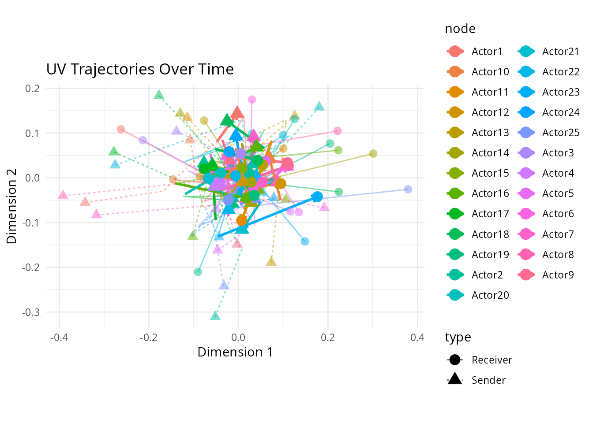
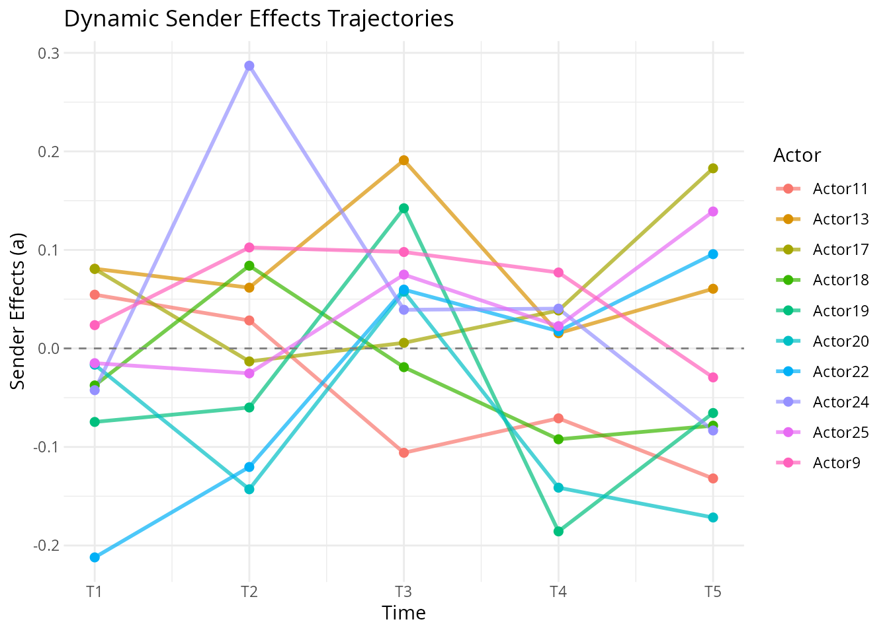
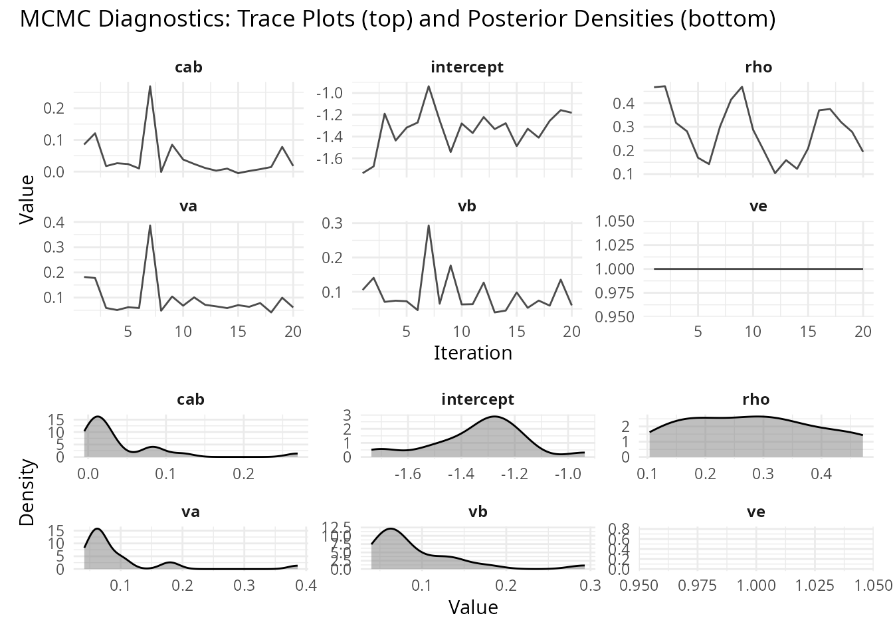

# Dynamic Effects in Longitudinal AME Models

## Introduction

Networks change. Countries that were close allies a decade ago may have
drifted apart. A legislator’s co-sponsorship patterns shift as they gain
seniority or switch committee assignments. A user’s purchasing habits
evolve as their tastes change.

The standard AME model assumes that each actor has a fixed latent
position and fixed additive effects across all time periods. This is a
reasonable starting point (pooling across time gives you more data and
more precise estimates), but it can miss important dynamics. The `lame`
package provides two mechanisms for letting the model capture temporal
change: `dynamic_uv` for time-varying latent positions and `dynamic_ab`
for time-varying additive effects.

This vignette explains what these options do, when to use them, and how
to interpret the results.

## What Are Dynamic Effects?

### The Static Baseline

In the standard AME model for longitudinal data, the tie between actors
$i$ and $j$ at time $t$ is:

$$y_{ij,t} = \beta\prime x_{ij,t} + a_{i} + b_{j} + u_{i}\prime v_{j} + \epsilon_{ij,t}$$

The covariates ($x_{ij,t}$) can vary over time, but everything else (the
sender effect $a_{i}$, the receiver effect $b_{j}$, and the latent
positions $u_{i}$ and $v_{j}$) is constant. This means the model assumes
that a country’s tendency to sanction others, or its position in the
latent “sanctioning space,” is the same in 1993 as in 2000.

### Dynamic Latent Positions (`dynamic_uv = TRUE`)

When you set `dynamic_uv = TRUE`, each actor’s latent position evolves
over time according to an AR(1) process:

$$U_{i,k,t} = \rho_{uv}\, U_{i,k,t - 1} + \epsilon_{i,k,t}$$$$V_{j,k,t} = \rho_{uv}\, V_{j,k,t - 1} + \eta_{j,k,t}$$

The autoregressive parameter $\rho_{uv}$ controls how persistent the
positions are. A value close to 1 means positions change slowly, as last
year’s position is a strong predictor of this year’s. A value close to 0
means positions are essentially re-drawn each period. In practice,
$\rho_{uv}$ is estimated from the data, so you don’t need to choose it
yourself.

This is useful when you believe the underlying community structure is
evolving: alliances shift, social groups re-form, trading blocs realign.

### Dynamic Additive Effects (`dynamic_ab = TRUE`)

When you set `dynamic_ab = TRUE`, the sender and receiver effects evolve
over time:

$$a_{i,t} = \rho_{ab}\, a_{i,t - 1} + \epsilon_{i,t}$$$$b_{j,t} = \rho_{ab}\, b_{j,t - 1} + \eta_{j,t}$$

This captures changes in actors’ overall activity levels. A country
might become a more active sanctioner after a change in government. A
student might become more or less socially active across semesters.
These are changes in how much an actor participates, not in who they
connect with (that’s what `dynamic_uv` captures).

You can use either option alone or combine them. In practice,
`dynamic_ab` is often a good place to start, since changes in overall
activity are common and relatively easy to estimate. `dynamic_uv` adds
more flexibility but also more parameters.

## Prior Specifications

The AR(1) coefficients and innovation variances have sensible default
priors:

- $\rho_{uv} \sim \text{TruncNormal}(0.9,0.1,0,1)$, centered on high
  persistence
- $\rho_{ab} \sim \text{TruncNormal}(0.8,0.15,0,1)$, slightly less
  persistent
- $\sigma_{uv}^{2},\sigma_{ab}^{2} \sim \text{InverseGamma}(2,1)$

These can be customized via the `prior` argument if you have strong
beliefs about the rate of change:

``` r
prior_custom <- list(
  rho_uv_mean = 0.95,    # expect very slow change in latent positions
  rho_uv_sd = 0.05,      # tight prior
  sigma_uv_shape = 3,
  sigma_uv_scale = 2
)
```

## Practical Example

We simulate a simple longitudinal network and fit models with and
without dynamic effects to see the difference.

``` r
library(lame)

set.seed(6886)
n <- 25  # actors
n_periods <- 5

# Generate sparse binary networks
Y_list <- list()
for(t in 1:n_periods) {
  Y_t <- matrix(rbinom(n*n, 1, 0.1), n, n)
  diag(Y_t) <- NA
  rownames(Y_t) <- colnames(Y_t) <- paste0("Actor", 1:n)
  Y_list[[t]] <- Y_t
}

# Fit model with both dynamic effects
# Note: iterations are reduced for vignette speed.
# Use burn >= 1000 and nscan >= 5000 for real analyses.
fit_dynamic <- lame(
  Y = Y_list,
  R = 2,
  dynamic_uv = TRUE,
  dynamic_ab = TRUE,
  family = "binary",
  burn = 100,
  nscan = 500,
  odens = 25,
  print = FALSE,
  plot = FALSE
)
#> Note: Square matrix assumed to be unipartite. Use mode='bipartite' for square bipartite networks.
```

### Visualizing Dynamic Effects

The trajectory plot shows how each actor’s latent position moves through
the 2-dimensional space over time. Each line traces one actor’s path
from the first to the last period. Actors whose lines are short stayed
in roughly the same position; actors with long, wandering lines
experienced substantial shifts in their network role.

``` r
uv_plot(fit_dynamic, plot_type = "trajectory")
```



The `ab_plot` with `plot_type = "trajectory"` shows how each actor’s
additive effect changes over time. Rising lines indicate actors who
became more active (or more popular) over the observation window;
falling lines indicate the opposite. This is particularly useful for
identifying actors who experienced a structural break in their network
behavior.

``` r
ab_plot(fit_dynamic, effect = "sender", plot_type = "trajectory")
#> ℹ Showing top 5 and bottom 5 actors by average effect
#> → Use `show_actors` to specify actors to display
```



As always, check convergence. Dynamic models have more parameters, so
adequate mixing is harder to achieve and requires longer chains.

``` r
trace_plot(fit_dynamic)
```



### Comparing Model Specifications

A natural workflow is to fit several specifications and compare them:

``` r
# Static model (no dynamic effects)
fit_static <- lame(Y_list, R = 2, family = "binary",
                   burn = 100, nscan = 400, odens = 20,
                   print = FALSE, plot = FALSE)

# Dynamic latent positions only
fit_uv <- lame(Y_list, R = 2, dynamic_uv = TRUE, family = "binary",
               burn = 100, nscan = 400, odens = 20,
               print = FALSE, plot = FALSE)

# Dynamic additive effects only
fit_ab <- lame(Y_list, R = 2, dynamic_ab = TRUE, family = "binary",
               burn = 100, nscan = 400, odens = 20,
               print = FALSE, plot = FALSE)

# Full dynamic
fit_full <- lame(Y_list, R = 2, dynamic_uv = TRUE, dynamic_ab = TRUE,
                 family = "binary",
                 burn = 100, nscan = 400, odens = 20,
                 print = FALSE, plot = FALSE)
```

Compare the GOF statistics across models. The model that best reproduces
the observed network statistics (heterogeneity, transitivity, dyadic
dependence) without unnecessary complexity is usually the best choice.

``` r
if(!is.null(fit_static$GOF) && !is.null(fit_full$GOF)) {
  cat("Static model GOF (sample):\n")
  print(head(fit_static$GOF))
  cat("\nFull dynamic model GOF (sample):\n")
  print(head(fit_full$GOF))
}
#> Static model GOF (sample):
#> $sd.rowmean
#>             obs          1          2          3          4          5
#> [1,] 0.04659041 0.05576140 0.05874238 0.06140575 0.05450382 0.09871170
#> [2,] 0.06641285 0.06997142 0.07756288 0.08380931 0.05331666 0.06733003
#> [3,] 0.05033223 0.06997142 0.05033223 0.04369592 0.05964338 0.06974238
#> [4,] 0.06332982 0.06294972 0.06031031 0.05416026 0.05656854 0.06140575
#> [5,] 0.05941941 0.06248200 0.07240626 0.05656854 0.07578918 0.06665333
#>               6          7          8          9         10         11
#> [1,] 0.06645299 0.05450382 0.05205126 0.04855238 0.06625204 0.05096404
#> [2,] 0.06733003 0.06324555 0.06416645 0.06013319 0.06633250 0.07831560
#> [3,] 0.07259017 0.07400901 0.05782733 0.05075431 0.05666274 0.05689757
#> [4,] 0.06273755 0.06685307 0.05787343 0.06544209 0.06633250 0.05805744
#> [5,] 0.04000000 0.05523284 0.08336266 0.06819580 0.08073000 0.05887841
#>              12         13         14         15         16         17
#> [1,] 0.05033223 0.05547372 0.07368401 0.06499231 0.05499091 0.07659417
#> [2,] 0.06231105 0.07493998 0.05773503 0.07125541 0.05101634 0.07393691
#> [3,] 0.05301572 0.07162867 0.06379133 0.07222188 0.05276362 0.06725077
#> [4,] 0.05717808 0.05919459 0.05941941 0.06183850 0.05619015 0.06901208
#> [5,] 0.05376492 0.06358197 0.05694442 0.07571878 0.05991105 0.05425864
#>              18         19         20
#> [1,] 0.05878775 0.07072953 0.06531973
#> [2,] 0.07454752 0.06166577 0.06920501
#> [3,] 0.06162251 0.07404503 0.07211103
#> [4,] 0.06118823 0.05619015 0.07302967
#> [5,] 0.06780364 0.05833238 0.05946427
#> 
#> $sd.colmean
#>             obs          1          2          3          4          5
#> [1,] 0.06955094 0.06035451 0.06311894 0.05919459 0.05070174 0.04332820
#> [2,] 0.05547372 0.05741080 0.05901412 0.06601010 0.06764614 0.08246211
#> [3,] 0.06429101 0.06503332 0.05773503 0.05205126 0.04855238 0.07525955
#> [4,] 0.05043808 0.05503938 0.06140575 0.07023769 0.05656854 0.05200000
#> [5,] 0.04393935 0.05919459 0.06358197 0.06110101 0.06740920 0.07773459
#>               6          7          8          9         10         11
#> [1,] 0.06744875 0.06760671 0.04942334 0.06183850 0.04888081 0.05474791
#> [2,] 0.04472136 0.08640988 0.06416645 0.06939741 0.04760952 0.05773503
#> [3,] 0.05717808 0.06437391 0.06839103 0.04805552 0.07490438 0.07236942
#> [4,] 0.07259017 0.06784296 0.05552177 0.06337192 0.05656854 0.05805744
#> [5,] 0.05163978 0.06096994 0.07493998 0.07292005 0.08860399 0.07023769
#>              12         13         14         15         16         17
#> [1,] 0.04320494 0.07218495 0.08384112 0.06075086 0.06183850 0.07393691
#> [2,] 0.07313914 0.05901412 0.06324555 0.06118823 0.05600000 0.06324555
#> [3,] 0.05782733 0.07787169 0.07529498 0.07582436 0.04301938 0.06101366
#> [4,] 0.06784296 0.08428523 0.06478683 0.05851496 0.06499231 0.05741080
#> [5,] 0.06800000 0.06358197 0.05576140 0.06429101 0.05647418 0.07922962
#>              18         19         20
#> [1,] 0.05022616 0.06482798 0.07023769
#> [2,] 0.05619015 0.05101634 0.07295661
#> [3,] 0.05713143 0.06013319 0.05291503
#> [4,] 0.06332982 0.05964338 0.05887841
#> [5,] 0.05828665 0.04548993 0.06482798
#> 
#> $dyad.dep
#>               obs           1           2           3             4
#> [1,]  0.019269395 -0.08131488 0.008055339  0.13695707  2.206228e-02
#> [2,] -0.009636809  0.04974761 0.099728860  0.03073677 -5.142499e-02
#> [3,]  0.021291209  0.04974761 0.078171091  0.03103972  1.081274e-01
#> [4,]  0.146174863  0.04974761 0.019269395 -0.06932153 -8.187141e-17
#> [5,] -0.003450161  0.09772784 0.089561985  0.06692407  3.717591e-02
#>                 5          6            7            8            9          10
#> [1,] -0.009636809 0.13503361  0.038812428  0.113504420  0.027048064 0.007076834
#> [2,] -0.013049451 0.04347826  0.066924067 -0.029376535 -0.006185392 0.089972527
#> [3,]  0.110953058 0.05408327  0.037175910  0.073508894  0.031039715 0.129623440
#> [4,]  0.136957068 0.05408327 -0.023134421 -0.006185392 -0.002692947 0.115044248
#> [5,]  0.058167571 0.01819923  0.008055339 -0.038503409 -0.029376535 0.082919087
#>                11          12          13          14          15          16
#> [1,]  0.003507653  0.01819923  0.16443850 -0.02627258  0.18963238 -0.05403126
#> [2,] -0.032448378  0.03311752  0.03311752  0.01819923 -0.07182304 -0.02393511
#> [3,]  0.176186292 -0.03549006  0.04963948 -0.10035211  0.09972886 -0.01800033
#> [4,]  0.058498619  0.01547443  0.03881243 -0.04615017  0.06135015  0.10812739
#> [5,]  0.055631868  0.06758773 -0.01019264  0.07227207  0.02312600  0.05220971
#>                 17          18           19           20
#> [1,]  0.0990990991  0.14247545  0.042929560 -0.081730769
#> [2,]  0.0347490347  0.02704806  0.015474426  0.035105383
#> [3,] -0.0391850308  0.09208475 -0.002692947 -0.016746411
#> [4,]  0.0877577084 -0.03549006  0.067587728 -0.069321534
#> [5,]  0.0008429252 -0.04078090 -0.023134421  0.009927131
#> 
#> $cycle.dep
#>              obs             1            2             3            4
#> [1,] 0.004000134  0.0009460156  0.008101547 -0.0051947200 -0.013828250
#> [2,] 0.021198238  0.0255683605 -0.018621227  0.0087498469 -0.005484807
#> [3,] 0.002352264 -0.0108900015  0.009409970  0.0009646276 -0.008276965
#> [4,] 0.006223826  0.0089952373  0.007683338  0.0265516983 -0.001790639
#> [5,] 0.006189746 -0.0118244863  0.012019258  0.0028009721  0.009436416
#>                 5            6            7            8            9
#> [1,]  0.017513991 -0.022978699 -0.013569120 -0.003542890 -0.001878817
#> [2,]  0.012264095 -0.019057519  0.015161076 -0.010841243  0.022022301
#> [3,] -0.015367160 -0.003294614 -0.037392357 -0.003425668 -0.008645739
#> [4,] -0.004458079 -0.016446357 -0.005413791  0.001021086  0.030579654
#> [5,] -0.002681326 -0.007363859  0.034413021 -0.006637987  0.031948619
#>                10            11           12           13           14
#> [1,]  0.012095359 -0.0165950818  0.003815011  0.022649941  0.013925773
#> [2,]  0.002352264  0.0003596167 -0.001486717 -0.002966703 -0.021559250
#> [3,] -0.042775678 -0.0041029133 -0.007716938  0.021927831 -0.010538347
#> [4,] -0.024993359  0.0437524234  0.012053366 -0.010781135 -0.012288669
#> [5,]  0.011129941  0.0180819085  0.011235314 -0.013904509 -0.004889475
#>                15           16            17           18           19
#> [1,] -0.004869438  0.010489094 -0.0006188194 -0.025369866 -0.013196668
#> [2,]  0.021595013 -0.020066847 -0.0059927775 -0.010833461 -0.010564034
#> [3,] -0.008176773  0.001714339  0.0001090225 -0.008673827  0.002781151
#> [4,] -0.003483508  0.006440158 -0.0238248161  0.013739410 -0.017231609
#> [5,]  0.007503381 -0.006637254  0.0064114225 -0.005770419 -0.009125562
#>                20
#> [1,]  0.002352264
#> [2,] -0.016546828
#> [3,]  0.001302982
#> [4,]  0.016482431
#> [5,]  0.014218855
#> 
#> $trans.dep
#>              obs           1            2           3           4           5
#> [1,] -0.03405087 -0.01725131 -0.015921262 -0.02439561 -0.01790421 -0.01257219
#> [2,] -0.02658332 -0.02213112 -0.036695001 -0.01839281 -0.02778143 -0.03720528
#> [3,] -0.02865812 -0.02199730 -0.008510928 -0.02102015 -0.04129031 -0.01456443
#> [4,] -0.02792264 -0.02067580 -0.020594018 -0.03995741 -0.02622008 -0.02120350
#> [5,] -0.03012973 -0.03257758 -0.029288661 -0.04035354 -0.02066110 -0.04610502
#>                6            7           8           9          10           11
#> [1,] -0.03158134 -0.026314191 -0.02157296 -0.02863680 -0.02480713 -0.007500892
#> [2,] -0.03568489 -0.008989166 -0.02768337 -0.02405309 -0.04661433 -0.031965927
#> [3,] -0.02673828 -0.029001322 -0.02661338 -0.02522528 -0.05030914 -0.028451519
#> [4,] -0.02018381 -0.040099799 -0.02631793 -0.02450490 -0.02870940 -0.017077436
#> [5,] -0.01907506 -0.030282635 -0.02101336 -0.04267821 -0.02210883 -0.020505997
#>               12           13           14          15          16          17
#> [1,] -0.01957781 -0.006002866 -0.033694251 -0.03310867 -0.02412263 -0.04432701
#> [2,] -0.02178203 -0.031361790 -0.028656945 -0.02846198 -0.03155093 -0.04177031
#> [3,] -0.02625382 -0.017626911 -0.028193876 -0.02670351 -0.01836526 -0.03858842
#> [4,] -0.02988494 -0.019324316 -0.007578192 -0.03040507 -0.02746220 -0.01981431
#> [5,] -0.02060342 -0.009467865 -0.014717185 -0.03434931 -0.02766951 -0.03495360
#>               18           19          20
#> [1,] -0.02403337 -0.022243825 -0.03303944
#> [2,] -0.02955806 -0.037406946 -0.03163719
#> [3,] -0.02039266 -0.015104886 -0.02107237
#> [4,] -0.03215138 -0.015591767 -0.03168623
#> [5,] -0.00988358 -0.009429525 -0.03764835
#> 
#> 
#> Full dynamic model GOF (sample):
#> $sd.rowmean
#>             obs          1          2          3          4          5
#> [1,] 0.04659041 0.05736433 0.05896892 0.04636090 0.05499091 0.05642694
#> [2,] 0.06641285 0.05406169 0.09318083 0.05887841 0.08554141 0.08460102
#> [3,] 0.05033223 0.07364781 0.06831301 0.04898979 0.06641285 0.06740920
#> [4,] 0.06332982 0.07050296 0.06858571 0.07571878 0.08830251 0.08223543
#> [5,] 0.05941941 0.05773503 0.05805744 0.04000000 0.06661331 0.08000000
#>               6          7          8          9         10         11
#> [1,] 0.07016172 0.04963869 0.02026491 0.09729680 0.05225578 0.08304216
#> [2,] 0.06877984 0.06429101 0.03525148 0.07418895 0.03555278 0.07564831
#> [3,] 0.07735632 0.07393691 0.04687572 0.09443163 0.04543127 0.05623759
#> [4,] 0.07436845 0.04898979 0.05163978 0.07125541 0.04270831 0.05547372
#> [5,] 0.06601010 0.04601449 0.02612789 0.08092795 0.03946306 0.03843609
#>              12         13         14         15         16         17
#> [1,] 0.11530828 0.06862458 0.07635007 0.04543127 0.09572182 0.05656854
#> [2,] 0.09965273 0.05782733 0.07635007 0.06337192 0.08349052 0.06166577
#> [3,] 0.07110556 0.06075086 0.08009994 0.04163332 0.07292005 0.08320256
#> [4,] 0.06661331 0.06916647 0.03448671 0.04749737 0.07236942 0.05600000
#> [5,] 0.08979978 0.05075431 0.05887841 0.04543127 0.05986652 0.08082904
#>              18         19         20
#> [1,] 0.05225578 0.06008882 0.05163978
#> [2,] 0.05600000 0.08326664 0.03525148
#> [3,] 0.03815757 0.06544209 0.04472136
#> [4,] 0.04548993 0.07302967 0.04630335
#> [5,] 0.02508652 0.05764258 0.03158058
#> 
#> $sd.colmean
#>             obs          1          2          3          4          5
#> [1,] 0.06955094 0.08845338 0.05896892 0.06843001 0.05964338 0.08708616
#> [2,] 0.05547372 0.06725077 0.08092795 0.04320494 0.06621178 0.05964338
#> [3,] 0.06429101 0.09429033 0.08246211 0.04163332 0.08252676 0.06839103
#> [4,] 0.05043808 0.05070174 0.05919459 0.05163978 0.06269503 0.07368401
#> [5,] 0.04393935 0.06928203 0.05070174 0.04472136 0.05919459 0.06928203
#>               6          7          8          9         10         11
#> [1,] 0.08634813 0.06374951 0.03282276 0.08793937 0.04079216 0.07547185
#> [2,] 0.07346655 0.06218253 0.03709447 0.09748846 0.03158058 0.07203703
#> [3,] 0.08475848 0.06928203 0.03555278 0.07821338 0.03912374 0.06803920
#> [4,] 0.06374951 0.06110101 0.04163332 0.08569714 0.04270831 0.05547372
#> [5,] 0.06075086 0.07200000 0.02856571 0.08726970 0.04715930 0.07922962
#>              12         13         14         15         16         17
#> [1,] 0.09360912 0.07943131 0.05968808 0.04393935 0.09846827 0.05291503
#> [2,] 0.07346655 0.06226824 0.06079474 0.05787343 0.05070174 0.05600000
#> [3,] 0.08787870 0.08460102 0.05552177 0.03651484 0.07012370 0.06823489
#> [4,] 0.08428523 0.05986652 0.06725077 0.04150502 0.08662563 0.05600000
#> [5,] 0.06053098 0.04519587 0.04898979 0.05351635 0.06205374 0.07302967
#>              18         19         20
#> [1,] 0.03362539 0.07310267 0.05033223
#> [2,] 0.05717808 0.06633250 0.04805552
#> [3,] 0.04460194 0.06544209 0.04898979
#> [4,] 0.05230679 0.07211103 0.04484046
#> [5,] 0.03600000 0.05991105 0.04687572
#> 
#> $dyad.dep
#>               obs           1          2           3          4          5
#> [1,]  0.019269395  0.02704806 0.09753216  0.05198566 0.15785326 0.04548721
#> [2,] -0.009636809  0.11900926 0.17999831  0.06174334 0.08521711 0.23204433
#> [3,]  0.021291209  0.12607413 0.10606061  0.06174334 0.16443850 0.16443850
#> [4,]  0.146174863 -0.02683461 0.13695707 -0.04347826 0.16115425 0.20178799
#> [5,] -0.003450161  0.18261563 0.11985605 -0.04166667 0.05849862 0.22566372
#>              6          7           8         9        10        11        12
#> [1,] 0.2089786 0.25274988  0.12321721 0.3102797 0.2776422 0.2352557 0.3982670
#> [2,] 0.2678688 0.11504425  0.52887080 0.5001272 0.0368563 0.2149730 0.3360054
#> [3,] 0.1125448 0.11123853  0.13338880 0.3680763 0.0368563 0.2358734 0.2501781
#> [4,] 0.2029234 0.19299451  0.45833333 0.3580203 0.1683059 0.3733289 0.3989662
#> [5,] 0.1451059 0.08640996 -0.01957586 0.3122566 0.2608798 0.1992536 0.3255506
#>                13         14          15         16         17          18
#> [1,] 0.2779284710 0.18084310  0.03685630 0.10779835 0.10287081 -0.03993344
#> [2,] 0.0008429252 0.08775771  0.32753519 0.10397769 0.09269212 -0.02393511
#> [3,] 0.1260741343 0.14054890  0.12500000 0.03727665 0.05387632 -0.03820598
#> [4,] 0.2546213476 0.03510538 -0.04515050 0.02332011 0.12590905  0.01190978
#> [5,] 0.0107119193 0.17391304 -0.04340568 0.01745541 0.19299451 -0.02796053
#>              19         20
#> [1,] 0.10984188 0.14529915
#> [2,] 0.07575758 0.02787748
#> [3,] 0.06892798 0.03846154
#> [4,] 0.04129794 0.05678174
#> [5,] 0.11900926 0.11711827
#> 
#> $cycle.dep
#>              obs            1            2            3            4
#> [1,] 0.004000134 -0.004863698 -0.010484886 -0.021129984  0.018973901
#> [2,] 0.021198238 -0.017274191 -0.005873411  0.010925973  0.009328688
#> [3,] 0.002352264 -0.028981326 -0.003795519  0.002227218 -0.005053393
#> [4,] 0.006223826 -0.021882546  0.004000134  0.010871739 -0.007014093
#> [5,] 0.006189746 -0.026868396 -0.024463582 -0.002375735 -0.003839827
#>                 5            6            7            8            9
#> [1,] -0.008536230 -0.039303728 -0.008285261 -0.006319956 -0.031421404
#> [2,] -0.015537100 -0.016013806 -0.009290098 -0.018414400 -0.001847216
#> [3,] -0.012795810  0.005121326 -0.012259145  0.012855259 -0.005000272
#> [4,]  0.008669044  0.001299266 -0.018818113 -0.020702835 -0.007237220
#> [5,] -0.004375336  0.010796637  0.013911535 -0.004497010 -0.015735101
#>                10           11           12           13            14
#> [1,] -0.003976914  0.007972305 -0.041457924 -0.016025802 -0.0002344697
#> [2,] -0.013985926 -0.037935778 -0.005536017  0.008369461 -0.0172758605
#> [3,]  0.007071495 -0.004166583 -0.029591872 -0.037431037  0.0365569627
#> [4,]  0.012392833 -0.005757249 -0.049784475  0.018714811  0.0198213194
#> [5,]  0.012672939 -0.024970320 -0.008342543  0.002984650 -0.0094648083
#>                15           16           17            18           19
#> [1,] -0.001975112 -0.018128598 -0.002134195  0.0003731671 -0.002534585
#> [2,] -0.011133850 -0.033652564 -0.028814645  0.0084323291 -0.006474708
#> [3,] -0.012557457 -0.005626893  0.002051449  0.0001126648 -0.017307656
#> [4,]  0.014364305  0.017188891  0.006429071  0.0035152534 -0.009469906
#> [5,]  0.004030296  0.007977255 -0.030992427 -0.0015654845 -0.020329116
#>                20
#> [1,] -0.013969712
#> [2,]  0.003129132
#> [3,] -0.009789250
#> [4,] -0.016958608
#> [5,]  0.015078705
#> 
#> $trans.dep
#>              obs           1            2            3           4            5
#> [1,] -0.03405087 -0.01061236 -0.021724260 -0.017865778 -0.03260994 -0.030969234
#> [2,] -0.02658332 -0.03694693 -0.044817618 -0.034753000 -0.03164718 -0.038850210
#> [3,] -0.02865812 -0.03296481 -0.008037569 -0.027104818 -0.04159892 -0.021102777
#> [4,] -0.02792264 -0.03245686 -0.011065922 -0.010488031 -0.02633641 -0.003111548
#> [5,] -0.03012973 -0.03095706 -0.026873769 -0.007805987 -0.04010184 -0.024793572
#>                6           7           8           9            10          11
#> [1,] -0.04255652 -0.02656948 -0.01426403 -0.04868229 -0.0293330781 -0.04475317
#> [2,] -0.05054492 -0.01242675 -0.02487811 -0.03806017 -0.0059530524 -0.04797191
#> [3,] -0.03308699 -0.02729886 -0.02795989 -0.03181522 -0.0216466701 -0.02575960
#> [4,] -0.03805555 -0.01813578 -0.02647248 -0.03324686 -0.0067048086 -0.01712892
#> [5,] -0.04215480 -0.01692475 -0.01398437 -0.04468652  0.0009406761 -0.04749371
#>               12          13          14           15          16           17
#> [1,] -0.07415339 -0.03666564 -0.02796993 -0.026664008 -0.03025114 -0.028845334
#> [2,] -0.04006404 -0.02959147 -0.02296751 -0.018021200 -0.04610224 -0.029388322
#> [3,] -0.06497210 -0.02797427 -0.01721970 -0.016969537 -0.03071219 -0.029924585
#> [4,] -0.08435361 -0.02350339 -0.02408716 -0.005985249 -0.02527722 -0.005199903
#> [5,] -0.03329674 -0.02908207 -0.03632440 -0.021313036 -0.01503230 -0.024312715
#>                18          19           20
#> [1,] -0.025195687 -0.03453933 -0.038286069
#> [2,] -0.009011132 -0.03081068 -0.030140114
#> [3,] -0.013557125 -0.01512401 -0.003065672
#> [4,] -0.011282700 -0.03158633 -0.028775805
#> [5,] -0.015283647 -0.03594802 -0.016975798
```

### When to Use Dynamic Effects

**Use `dynamic_ab`** when you suspect actors’ overall activity levels
change over time. This is common in many settings: countries go through
isolationist vs. interventionist phases, users churn in and out of
platforms, students become more or less engaged across semesters.

**Use `dynamic_uv`** when you suspect the underlying community structure
is shifting. This is a stronger claim, not just that actors are more or
less active, but that the pattern of *who connects with whom* is
changing. Examples include political realignment, market disruption, or
generational turnover in a social network.

**Use both** when you believe both types of change are happening. This
is the most flexible specification but also the most data-hungry. With
short panels (few time periods) or sparse networks, the dynamic
parameters may not be well-identified, and you might be better off with
the static model.

**Stick with static** when you have few time periods, when the network
structure is genuinely stable, or when you primarily care about the
covariate effects (which are the same across specifications) rather than
the latent structure.

## Implementation Notes

The dynamic effects are implemented in C++ via Rcpp and RcppArmadillo
using a forward-filtering backward-sampling (FFBS) algorithm. This is
the standard approach for state-space models: the forward pass computes
predictive distributions $p\left( x_{t}|x_{1:t - 1} \right)$, and the
backward pass samples from the smoothed distribution
$p\left( x_{1:T}|y_{1:T} \right)$.

## References

1.  **Hoff, PD (2021)**. Additive and Multiplicative Effects Network
    Models. *Statistical Science* 36, 34–50.

2.  **Sewell, D. K., & Chen, Y. (2015)**. Latent space models for
    dynamic networks. *Journal of the American Statistical Association*,
    110(512), 1646-1657.

3.  **Durante, D., & Dunson, D. B. (2014)**. Nonparametric Bayes dynamic
    modeling of relational data. *Biometrika*, 101(4), 883-898.
